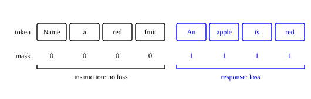

::: card
A model trained on next-token prediction completes text. It does not follow instructions. Give
it "What is the capital of France?" and it may continue with "is a common geography question",
or with "The capital of Germany is Berlin". Both are plausible text. Neither is an answer.
:::

::: card
**Instruction tuning** closes the gap. Fine-tune the pretrained model on pairs of an instruction
and a good response:

*Instruction:* Summarize the following article in three sentences. [article]

*Response:* The article discusses … Key findings include … The authors conclude …

The response shows the behaviour you want. The model learns by example what a fitting answer to
each kind of request looks like.
:::

::: card
The instructions must vary: translate this, write a function that sorts a list, explain
entanglement to a child, list the pros and cons of solar power. A model tuned only on translation
does not learn to answer questions. Broad coverage of tasks gives a general assistant.
:::

::: card
The loss is the language modeling loss, with one change: only the response counts. For an
instruction $x = (x_1, \ldots, x_n)$ and a response $r = (r_1, \ldots, r_m)$:
[Instruction tuning loss](reference:instruction-tuning-loss)

$$ \mathcal{L}_{IT} = -\sum_{t=1}^{m} \log P(r_t \mid x_1, \ldots, x_n, r_1, \ldots, r_{t-1}) $$

The user writes the instruction at inference. The model never has to produce it, so it is not
graded on it.
:::

::: card
In practice the model runs over the whole sequence of $n + m$ tokens, and a mask switches the
loss off on the instruction ([Figure](figure:loss-mask)):

$$ \mathcal{L}_{IT} = -\sum_{t=1}^{n+m} \text{mask}_t \cdot \log P(\text{token}_t \mid \text{token}_1, \ldots, \text{token}_{t-1}) $$

with $\text{mask}_t = 0$ on the instruction and $\text{mask}_t = 1$ on the response.
:::

::: figure loss-mask

The instruction tokens still flow through the model as context. Only the response tokens add to
the loss.
:::

::: card
The pairs come from five sources. Humans write them: reliable, slow and expensive. Crowd
workers write them: cheaper and noisier. Existing datasets are reformatted, so a sentiment set
becomes "Classify the sentiment of this review" with the label as the response. A larger model
writes the responses, which is **distillation**. Deployed systems collect real requests, with
consent.
:::

::: card
A real dataset mixes the sources. One might hold 10,000 human-written examples for quality,
100,000 reformatted examples for coverage, and 50,000 synthetic examples for scale. The
reformatted ones are cheap but rarely conversational, so the other two fill that gap.
:::

::: card
Tuning reshapes the distribution the model already has. Before it,
$P(\text{"Paris"} \mid \text{"What is the capital of France?"})$ is low, because the model expects
a document. After it, the probability is high.

The model learns the format of an answer, which kind of response each kind of task needs, to
address what was asked, and to decline some requests. The weights move little, which is why
tuning needs far less data than pretraining.
:::

::: card
Three settings keep the move small. The learning rate is $10^{-5}$ to $10^{-6}$, against about
$10^{-4}$ in pretraining. Training lasts 1 to 3 epochs, since more overfits the phrasing of the
instructions. A chat format marks the roles with special tokens, and the model learns to write
the text that follows `<|assistant|>`:

`<|user|>` What is the capital of France? `<|assistant|>` The capital of France is Paris.
:::

::: exercise it-response-loss
A response has three tokens. Given the instruction and the earlier response tokens, the model
gives them the probabilities $0.5$, $0.8$ and $0.25$. What is $\mathcal{L}_{IT}$?

::: answer
$\ln 10 \approx 2.303$. Add the negative logs of the three response probabilities.
:::

::: solution
$\mathcal{L}_{IT} = -\ln 0.5 - \ln 0.8 - \ln 0.25 = \ln 2 + \ln 1.25 + \ln 4$

$= \ln(2 \times 1.25 \times 4) = \ln 10 = 2.303$ ∎
:::
:::

::: exercise it-mask-count
An instruction has 12 tokens and its response has 8. How many terms of the masked sum have
$\text{mask}_t = 1$?

::: answer
8. Only the response positions count.
:::
:::

::: exercise it-mixture-share
A dataset holds 10,000 human-written, 100,000 reformatted and 50,000 synthetic examples. What
share of it is human-written?

::: answer
$6.25\%$. Divide 10,000 by the total of 160,000.
:::
:::

::: reference instruction-tuning-loss
# Instruction tuning loss

Instruction tuning trains on the language modeling loss of the response alone, conditioned on
the instruction.

::: equation
\mathcal{L}_{IT} = -\sum_{t=1}^{m} \log P(r_t \mid x_1, \ldots, x_n, r_1, \ldots, r_{t-1})
:::

::: legend
$\mathcal{L}_{IT}$: the loss of one example, in nats
$x_1, \ldots, x_n$: the instruction tokens
$r_1, \ldots, r_m$: the response tokens
$P$: the probability the model assigns
:::

::: derivation
Goal: the loss as a masked language modeling loss.
Concatenate the tokens: $\text{token}_{1..n} = x_{1..n}$ and $\text{token}_{n+t} = r_t$.
Apply the language modeling loss to all $n + m$ positions.[Language modeling loss](reference:language-modeling-loss)
Multiply term $t$ by $\text{mask}_t$, zero for $t \le n$ and one for $t > n$.
The surviving terms are $-\log P(r_t \mid x_{1..n}, r_{1..t-1})$ for $t = 1, \ldots, m$. ∎
:::
:::
