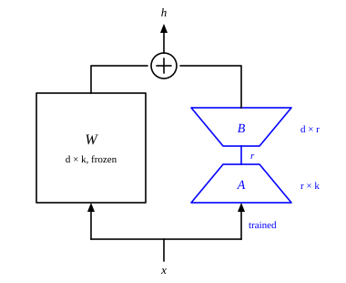

::: card
Most of a pretrained model can stay frozen. **Parameter-efficient fine-tuning** trains a small
number of new or chosen parameters and leaves the rest alone. Its most used method is **LoRA**,
low-rank adaptation.

LoRA keeps a pretrained matrix $\mathbf{W} \in \mathbb{R}^{d \times k}$ fixed and learns a
correction $\Delta\mathbf{W}$ to add to it. The correction is a product of two new, small matrices:

$$ \Delta\mathbf{W} = \mathbf{B}\mathbf{A} $$
:::

::: card
The two matrices are created for fine-tuning and do not exist in the pretrained model:

- $\mathbf{A} \in \mathbb{R}^{r \times k}$ projects down, from $k$ dimensions to $r$;
- $\mathbf{B} \in \mathbb{R}^{d \times r}$ projects back up, from $r$ to $d$;
- the **rank** $r$ is small, such as 8, 16 or 64.

$\mathbf{B}\mathbf{A}$ has the shape $d \times k$ of $\mathbf{W}$. Everything passes through $r$
dimensions, so its rank is at most $r$ ([matrix product](reference:matrix-product)). This is the low-rank constraint.
:::

::: card
The input takes two paths and the results add ([Figure](figure:lora-paths)). A scale
$\frac{\alpha}{r}$ sets the size of the correction:
[LoRA](reference:lora)

$$ \mathbf{h} = \mathbf{W}\mathbf{x} + \frac{\alpha}{r}\mathbf{B}\mathbf{A}\mathbf{x} $$

$\mathbf{W}$ never changes. Only $\mathbf{A}$ and $\mathbf{B}$ receive gradients. Setting $\alpha = r$
gives a factor of 1. Tied to $r$ this way, the learning rate carries over when you change the rank.
:::

::: figure lora-paths


The frozen matrix $\mathbf{W}$ maps $\mathbf{x}$ directly. The trained path squeezes $\mathbf{x}$ to $r$
dimensions with $\mathbf{A}$ and expands it to $d$ with $\mathbf{B}$. The two outputs add to give
$\mathbf{h}$.
:::

::: card
Take an attention matrix of $4096 \times 4096$ and rank $r = 16$. $\mathbf{W}$ holds 16,777,216
frozen numbers. $\mathbf{A}$ is $16 \times 4096$ and $\mathbf{B}$ is $4096 \times 16$: 65,536 trainable
numbers each.

The product $\mathbf{B}\mathbf{A}$ is never stored. $\mathbf{A}\mathbf{x}$ takes the 4096-dimensional
input down to 16 dimensions, and $\mathbf{B}$ takes it back up to 4096.
:::

::: card
$\mathbf{A}$ starts with small Gaussian values of variance $\frac{1}{r}$. $\mathbf{B}$ starts at zero.
So $\mathbf{B}\mathbf{A} = 0$ and $\mathbf{h} = \mathbf{W}\mathbf{x}$ at the first step: the model begins
exactly as it was pretrained. As $\mathbf{B}$ grows away from zero, the correction takes effect.
:::

::: card
Full fine-tuning trains $dk$ numbers in the matrix. LoRA trains $rk + dr = r(d + k)$. Drag the
sizes. On these log axes LoRA's count is a straight line in $r$, far below the flat line of full
fine-tuning. At $d = k = 4096$ and $r = 16$ it is 131,072 against 16,777,216, a factor of 128.

```plot
x: { var: r, label: "rank $r$", from: 1, to: 256, scale: log, grid: true }
y: { label: "trainable numbers", from: 1000, to: 1000000000, scale: log, grid: true }

inputs:
  - { name: d, min: 512, max: 8192, default: 4096, step: 512, label: "the output size d" }
  - { name: k, min: 512, max: 8192, default: 4096, step: 512, label: "the input size k" }

draw:
  - hline: { at: d * k, dash: true, label: "full: $dk$" }
  - curve: { is: r * (d + k), accent: true, label: "LoRA: $r(d + k)$" }
  - point: { at: [16, 16 * (d + k)], label: "$r = 16$" }
```
:::

::: card
You choose which matrices get LoRA, and each gets its own pair $\mathbf{A}$, $\mathbf{B}$. The most
common choice is $\mathbf{W}_Q$ and $\mathbf{W}_V$ in attention. Adding $\mathbf{W}_K$ and $\mathbf{W}_O$
gives more capacity, and the feed-forward weights more again, with diminishing returns.

LoRA on $\mathbf{W}_Q$ and $\mathbf{W}_V$ in each of 32 layers makes $32 \times 2 = 64$ pairs. Across a
large model, LoRA typically adds 0.1% to 1% of the base parameters.
:::

::: card
After training, fold the correction into the matrix:

$$ \mathbf{W}_{merged} = \mathbf{W} + \frac{\alpha}{r}\mathbf{B}\mathbf{A} $$

The merged model is one matrix per layer again, and runs at normal speed. Or keep the pairs apart,
and swap one task's pair for another's on the same base model.
:::

::: card
Why is a low rank enough? Adapting a model to legal text does not mean relearning English. It
means changing how existing knowledge is reached and combined: shifting attention toward legal
terms, reweighting some features. Such changes lie in a small subspace.

In practice a rank of 8 to 64 suffices for most tasks: a few dozen directions out of millions.
:::

::: exercise lora-count-rect
A matrix has $d = 1024$ and $k = 4096$. LoRA uses $r = 8$. How many numbers does LoRA train, and
how many times fewer is that than full fine-tuning of the matrix?

::: answer
40,960, which is 102.4 times fewer than 4,194,304. LoRA trains $r(d + k)$.
:::

::: solution
LoRA: $r(d + k) = 8 \times (1024 + 4096) = 8 \times 5120 = 40{,}960$

Full: $dk = 1024 \times 4096 = 4{,}194{,}304$

Ratio: $4{,}194{,}304 / 40{,}960 = 102.4$ ∎
:::
:::

::: exercise lora-first-step
At the first training step, what does a LoRA layer output for an input $\mathbf{x}$?

::: answer
$\mathbf{h} = \mathbf{W}\mathbf{x}$. $\mathbf{B}$ starts at zero, so the correction is zero.
:::
:::

::: exercise lora-max-rank
LoRA with $r = 16$ adapts a $4096 \times 4096$ matrix. What is the largest rank $\Delta\mathbf{W}$ can
have?

::: answer
16. $\Delta\mathbf{W} = \mathbf{B}\mathbf{A}$ passes through 16 dimensions.
:::
:::

::: exercise lora-qv-total
LoRA with $r = 16$ adapts $\mathbf{W}_Q$ and $\mathbf{W}_V$, each $4096 \times 4096$, in all 32 layers.
How many numbers does it train in total?

::: answer
8,388,608. That is 64 pairs of 131,072.
:::

::: solution
One pair: $r(d + k) = 16 \times 8192 = 131{,}072$

Pairs: $32 \times 2 = 64$

Total: $64 \times 131{,}072 = 8{,}388{,}608$ ∎
:::
:::

::: reference lora
# LoRA

Low-rank adaptation freezes a pretrained matrix and trains a correction of rank at most $r$, as
the product of two thin matrices.

::: equation
\mathbf{h} = \mathbf{W}\mathbf{x} + \frac{\alpha}{r}\mathbf{B}\mathbf{A}\mathbf{x}, \qquad \text{trainable numbers} = r(d + k)
:::

::: legend
$\mathbf{W}$: the frozen pretrained matrix, $d \times k$
$\mathbf{A}$: the trained down-projection, $r \times k$
$\mathbf{B}$: the trained up-projection, $d \times r$, zero at the start
$r$: the rank
$\alpha$: the scale, often equal to $r$
$\mathbf{x}$: the input, $k$ entries
$\mathbf{h}$: the output, $d$ entries
:::

::: derivation
Goal: the shape and rank of the correction, and its count of numbers.
$\mathbf{B}\mathbf{A}$ is $(d \times r)(r \times k) = d \times k$, the shape of $\mathbf{W}$.[Matrix product](reference:matrix-product)
Every column of $\mathbf{B}\mathbf{A}$ is $\mathbf{B}$ times a column of $\mathbf{A}$, so it lies in the span of the $r$ columns of $\mathbf{B}$.
So $\operatorname{rank}(\mathbf{B}\mathbf{A}) \le r$.
$\mathbf{A}$ holds $rk$ numbers and $\mathbf{B}$ holds $dr$: $rk + dr = r(d + k)$.
With $\mathbf{B} = 0$ at the start, $\mathbf{h} = \mathbf{W}\mathbf{x}$. ∎
:::
:::
