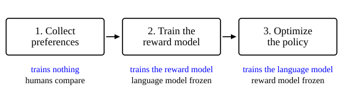

::: card
Predicting text is not the same as helping. A model trained on web text will produce toxic
content, state falsehoods with confidence, or miss what the user meant, because all of that is
likely text. **Reinforcement learning from human feedback** (RLHF) brings in human judgement of
what makes a response good.
:::

::: card
RLHF runs in three stages ([Figure](figure:rlhf-stages)). First, sample responses from the current
model and have humans compare them. Nothing trains. Second, train a separate **reward model** on
those comparisons, with the language model frozen. Third, train the language model to earn a high
reward, with the reward model frozen.
:::

::: figure rlhf-stages

Each stage trains at most one network. The reward model learns to score; then, with the scores
fixed, the language model learns to earn them.
:::

::: card
The reward model and the language model are two networks, and they never train at the same time.
The reward model is a tool built in stage two and used, unchanged, in stage three.
:::

::: card
Start from a pretrained, instruction-tuned model. For a prompt $x$, sample several responses
$y_1, y_2, \ldots, y_k$. Annotators look at pairs and pick the better one.

For "Explain quantum entanglement to a child", one response uses a clear analogy and another
uses jargon. The annotator marks the clear one.
:::

::: card
Why compare, and not score? Ask for a score from 1 to 10 and each annotator calibrates the scale
differently, and the same annotator drifts over a day. Put two responses side by side and people
pick the better one reliably, even when they cannot say why.
:::

::: card
The result is a dataset of triples $(x, y_w, y_l)$: a prompt, the winning response and the losing
response. Thousands of them record what people prefer about helpfulness, accuracy, safety and
style.
:::

::: card
The reward model $r_\phi(x, y)$ reads a prompt and a response and returns one number. It is
usually a transformer started from the same pretrained weights as the language model. Its
language modeling head, which outputs $V$ probabilities, is replaced by a linear layer with one
output. The representation of the final token passes through that layer to give the reward.

In this stage only $\phi$ trains.
:::

::: exercise pref-pair-count
For one prompt you sample $k = 4$ responses and ask annotators to compare every pair. How many
comparisons is that?

::: answer
6. The number of pairs is $\frac{k(k - 1)}{2}$.
:::

::: solution
$\frac{4 \times 3}{2} = 6$ ∎
:::
:::

::: exercise pref-stage-two
Which weights change in the second stage of RLHF?

::: answer
Only the reward model's, $\phi$. The language model is frozen.
:::
:::

::: exercise pref-head-size
The reward model's final layer maps a representation of size $d = 4096$ to one number, with a bias.
How many numbers does that layer hold?

::: answer
4097. It holds 4096 weights and one bias.
:::
:::
