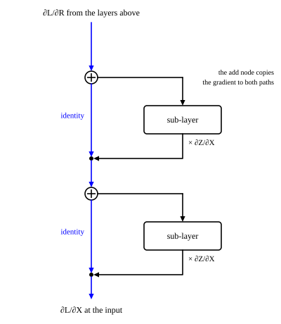

::: card
Training needs $\frac{\partial \mathcal{L}}{\partial \theta}$ for every weight $\theta$. The
backward pass runs the forward pass in reverse and applies the chain rule at each
step.[Chain rule](reference:chain-rule) At every layer it computes two things: the gradient of
the layer's own parameters, to update them, and the gradient of the layer's input, to pass to
the layer below.[Backpropagation](reference:backpropagation)

$$ \mathcal{L} \leftarrow \mathbf{P} \leftarrow \mathbf{L} \leftarrow \mathbf{Y}_{dec} \leftarrow \text{decoder layers} \leftarrow \mathbf{Y}^{(0)} \leftarrow \mathbf{E} $$
:::

::: card
The softmax and the cross-entropy fold into one clean gradient on the
logits.[Softmax cross-entropy gradient](reference:softmax-cross-entropy-gradient)

$$ \frac{\partial \mathcal{L}}{\partial L_{ij}} = \frac{1}{m}\big(P_{ij} - \delta_{j, y_i}\big) $$

Here $\delta_{j, y_i}$ is 1 for the true token and 0 otherwise. Row $i$ is
$\frac{1}{m}(\mathbf{p}_i - \mathbf{e}_{y_i})$: the prediction minus the one-hot target.
:::

::: card
Take $m = 1$ and hold the wrong logits at 0. The true logit gets $p - 1$, always negative, so
descent pushes it up. The wrong logits share $1 - p$, so descent pushes them down. Both fade as
$p \to 1$: a confident, correct model gets almost no gradient.

```plot
x: { var: z, label: "logit $z$ of the true token", from: -5, to: 20, ticks: 5, grid: true }
y: { label: "gradient", from: -1.1, to: 1.1, ticks: 0.5 }

inputs:
  - { name: k, min: 0.3, max: 5, default: 4.7, step: 0.1, label: "vocabulary size, as log10 of V" }

let:
  V: 10^k
  p: exp(z) / (exp(z) + V - 1)
  gtrue: p - 1
  gwrong: 1 - p

draw:
  - hline: { at: 0 }
  - curve: { is: gtrue, accent: true, label: "true logit" }
  - curve: { is: gwrong, dash: true, label: "wrong logits, summed" }
```
:::

::: card
Most of the network is linear layers, $\mathbf{Y} = \mathbf{X}\mathbf{W} + \mathbf{1}\mathbf{b}^T$.
Given the upstream gradient $\frac{\partial \mathcal{L}}{\partial \mathbf{Y}}$, three products
give everything.[Linear layer gradients](reference:linear-layer-gradients)

$$ \frac{\partial \mathcal{L}}{\partial \mathbf{W}} = \mathbf{X}^T\frac{\partial \mathcal{L}}{\partial \mathbf{Y}}, \qquad \frac{\partial \mathcal{L}}{\partial \mathbf{b}} = \sum_{\text{rows}}\frac{\partial \mathcal{L}}{\partial \mathbf{Y}}, \qquad \frac{\partial \mathcal{L}}{\partial \mathbf{X}} = \frac{\partial \mathcal{L}}{\partial \mathbf{Y}}\mathbf{W}^T $$
:::

::: card
Check the shapes on the output layer. $\mathbf{Y}_{dec}$ is $m \times 512$ and the logit
gradient is $m \times 50000$, so $\mathbf{Y}_{dec}^T\frac{\partial \mathcal{L}}{\partial \mathbf{L}}$
is $512 \times 50000$, the shape of $\mathbf{W}_{out}$. The weight gradient sums over the $m$
positions, because every position uses the same weights. The bias gradient sums over them for
the same reason.
:::

::: card
ReLU passes the gradient where its input was positive and blocks it elsewhere, entry by
entry.[ReLU](reference:relu)

$$ \frac{\partial \mathcal{L}}{\partial x} = \begin{cases} \frac{\partial \mathcal{L}}{\partial y} & x > 0 \\ 0 & x \le 0 \end{cases} $$

In the feed-forward network, a hidden unit that was off for a position gets no gradient from
that position.
:::

::: card
A residual sum $\mathbf{R} = \mathbf{X} + \mathbf{Z}$ copies its gradient to both
branches.[Residual gradient](reference:residual-gradient-split) The copy down the skip path is
untouched by the sub-layer. Even when the gradient through $\mathbf{Z}$ shrinks to nothing, the
gradient through $\mathbf{X}$ arrives whole ([Figure](figure:gradient-flow)).
:::

::: figure gradient-flow


The backward pass through two residual blocks. At each add node the gradient goes both ways.
The blue identity path carries it down unchanged; the side path multiplies it by the
sub-layer's derivative.
:::

::: card
Model each sub-layer as one number: it multiplies the gradient by $a$. A plain stack of $N$
sub-layers passes $a^N$. With $a = 0.8$ and $N = 12$, that is $0.069$. With residuals, one path
skips every sub-layer and passes exactly 1, whatever $a$ is. Slide $a$ and compare.

```plot
x: { var: n, label: "number of sub-layers $N$", from: 0, to: 24, ticks: 4, grid: true }
y: { label: "gradient that reaches the input", from: 0, to: 2, ticks: 0.5 }

inputs:
  - { name: a, min: 0.5, max: 1.2, default: 0.8, step: 0.05, label: "derivative of one sub-layer, a" }

draw:
  - hline: { at: 1, accent: true, label: "the identity path" }
  - curve: { is: a^n, label: "plain stack, $aᴺ$" }
```
:::

::: card
The embedding lookup copies rows of $\mathbf{E}$, so its gradient goes back into those rows
only. A token that appears at several positions collects the sum of their
gradients.[Embedding gradient](reference:embedding-row-gradient)

$$ \frac{\partial \mathcal{L}}{\partial \mathbf{E}[j, :]} = \sum_{i \,:\, t_i = j}\frac{\partial \mathcal{L}}{\partial \mathbf{X}_{embed}[i, :]} $$

A token absent from the batch gets zero gradient.
:::

::: exercise logit-gradient-row
With $m = 2$ target positions, position 1 predicts $[0.7, 0.2, 0.1]$ over a vocabulary of 3
tokens, and its true token is token 1. What is the gradient of $\mathcal{L}$ with respect to the
logits of position 1?

::: answer
$[-0.15, 0.10, 0.05]$. Subtract the one-hot target, then divide by $m$.
:::

::: solution
$$ \mathbf{p}_1 - \mathbf{e}_1 = [0.7 - 1, 0.2, 0.1] = [-0.3, 0.2, 0.1] $$

$$ \tfrac{1}{2}[-0.3, 0.2, 0.1] = [-0.15, 0.10, 0.05] $$

The entries sum to 0. ∎
:::
:::

::: exercise linear-layer-numbers
A linear layer has one input row $\mathbf{x} = [1, 2]$, weights
$\mathbf{W} = \begin{bmatrix} 1 & 0 \\ 2 & 1 \end{bmatrix}$, and upstream gradient
$\frac{\partial \mathcal{L}}{\partial \mathbf{y}} = [3, -1]$. Find
$\frac{\partial \mathcal{L}}{\partial \mathbf{W}}$ and $\frac{\partial \mathcal{L}}{\partial \mathbf{x}}$.

::: answer
$\frac{\partial \mathcal{L}}{\partial \mathbf{W}} = \begin{bmatrix} 3 & -1 \\ 6 & -2 \end{bmatrix}$
and $\frac{\partial \mathcal{L}}{\partial \mathbf{x}} = [3, 5]$. Use $\mathbf{x}^T\frac{\partial \mathcal{L}}{\partial \mathbf{y}}$
and $\frac{\partial \mathcal{L}}{\partial \mathbf{y}}\mathbf{W}^T$.
:::

::: solution
$$ \mathbf{x}^T\frac{\partial \mathcal{L}}{\partial \mathbf{y}} = \begin{bmatrix} 1 \\ 2 \end{bmatrix}[3, -1] = \begin{bmatrix} 3 & -1 \\ 6 & -2 \end{bmatrix} $$

$$ \frac{\partial \mathcal{L}}{\partial \mathbf{y}}\mathbf{W}^T = [3, -1]\begin{bmatrix} 1 & 2 \\ 0 & 1 \end{bmatrix} = [3 \cdot 1 + (-1) \cdot 0,\; 3 \cdot 2 + (-1) \cdot 1] = [3, 5] $$

∎
:::
:::

::: exercise repeated-token-gradient
Token 7 appears at positions 2 and 5. The gradients on those embedding rows are $[0.1, -0.2]$
and $[0.3, 0.1]$. What gradient reaches row 7 of $\mathbf{E}$?

::: answer
$[0.4, -0.1]$. Add the gradients of every position that used the row.
:::
:::

::: reference linear-layer-gradients
# Linear layer gradients

For a linear layer applied to every row of $\mathbf{X}$, the gradients of the weights, the bias
and the input are three matrix products of the upstream gradient.

::: equation
\frac{\partial \mathcal{L}}{\partial \mathbf{W}} = \mathbf{X}^T\frac{\partial \mathcal{L}}{\partial \mathbf{Y}}, \qquad
\frac{\partial \mathcal{L}}{\partial \mathbf{b}} = \mathbf{1}^T\frac{\partial \mathcal{L}}{\partial \mathbf{Y}}, \qquad
\frac{\partial \mathcal{L}}{\partial \mathbf{X}} = \frac{\partial \mathcal{L}}{\partial \mathbf{Y}}\mathbf{W}^T
:::

::: legend
$\mathbf{Y} = \mathbf{X}\mathbf{W} + \mathbf{1}\mathbf{b}^T$: the layer, applied to each of $n$ rows
$\mathbf{X}$: the input, $n \times d_{in}$
$\mathbf{W}$: the weights, $d_{in} \times d_{out}$
$\mathbf{b}$: the bias, $d_{out}$ entries, added to every row
$\mathbf{1}$: a column of $n$ ones
:::

::: derivation
Goal: each gradient, entry by entry.
Entry form of the layer: $Y_{pj} = \sum_i X_{pi}W_{ij} + b_j$.
$W_{ij}$ reaches $Y_{pj}$ for every row $p$, with $\frac{\partial Y_{pj}}{\partial W_{ij}} = X_{pi}$.
Sum over the paths: $\frac{\partial \mathcal{L}}{\partial W_{ij}} = \sum_p X_{pi}\frac{\partial \mathcal{L}}{\partial Y_{pj}} = \big(\mathbf{X}^T\tfrac{\partial \mathcal{L}}{\partial \mathbf{Y}}\big)_{ij}$.[Multivariable chain rule](reference:multivariable-chain-rule)
$b_j$ reaches $Y_{pj}$ for every $p$ with derivative 1: $\frac{\partial \mathcal{L}}{\partial b_j} = \sum_p \frac{\partial \mathcal{L}}{\partial Y_{pj}}$.
$X_{pi}$ reaches $Y_{pj}$ for every $j$ with derivative $W_{ij}$: $\frac{\partial \mathcal{L}}{\partial X_{pi}} = \sum_j \frac{\partial \mathcal{L}}{\partial Y_{pj}}W_{ij} = \big(\tfrac{\partial \mathcal{L}}{\partial \mathbf{Y}}\mathbf{W}^T\big)_{pi}$. ∎
:::
:::

::: reference residual-gradient-split
# The residual gradient

A residual sum passes its upstream gradient, unchanged, to both of its inputs.

::: equation
\mathbf{R} = \mathbf{X} + \mathbf{Z}(\mathbf{X}) \implies
\frac{\partial \mathcal{L}}{\partial \mathbf{X}} = \frac{\partial \mathcal{L}}{\partial \mathbf{R}} + \left.\frac{\partial \mathcal{L}}{\partial \mathbf{X}}\right|_{\text{through } \mathbf{Z}}
:::

::: legend
$\mathbf{X}$: the input of the residual block
$\mathbf{Z}$: the sub-layer output
$\mathbf{R}$: the sum
:::

::: derivation
Goal: the gradient of $\mathbf{X}$ through the sum.
Entry form: $R_{pj} = X_{pj} + Z_{pj}$, so $\frac{\partial R_{pj}}{\partial X_{pj}} = 1$ and $\frac{\partial R_{pj}}{\partial Z_{pj}} = 1$.
So $\frac{\partial \mathcal{L}}{\partial \mathbf{Z}} = \frac{\partial \mathcal{L}}{\partial \mathbf{R}}$, and the direct path gives $\frac{\partial \mathcal{L}}{\partial \mathbf{R}}$ to $\mathbf{X}$.[Residual connection](reference:residual-connection)
$\mathbf{X}$ also feeds $\mathbf{Z}$, so the gradient from the sub-layer adds to it.[Multivariable chain rule](reference:multivariable-chain-rule)
The direct term carries no factor from the sub-layer. ∎
:::
:::

::: reference embedding-row-gradient
# The embedding gradient

The lookup copies rows of the embedding matrix, so each row's gradient is the sum of the
gradients at the positions that used it.

::: equation
\frac{\partial \mathcal{L}}{\partial \mathbf{E}[j, :]} = \sum_{i \,:\, t_i = j}\frac{\partial \mathcal{L}}{\partial \mathbf{X}_{embed}[i, :]}
:::

::: legend
$\mathbf{E}$: the embedding matrix, $V \times d_{model}$
$t_i$: the token index at position $i$
$\mathbf{X}_{embed}$: the looked-up rows, $n \times d_{model}$
:::

::: derivation
Goal: the gradient of row $j$ of $\mathbf{E}$.
The lookup sets $\mathbf{X}_{embed}[i, :] = \mathbf{E}[t_i, :]$.[Embedding lookup](reference:embedding-lookup)
So $\frac{\partial X_{embed,ic}}{\partial E_{jc}} = 1$ when $t_i = j$, and 0 otherwise.
Sum over the positions: $\frac{\partial \mathcal{L}}{\partial E_{jc}} = \sum_{i : t_i = j}\frac{\partial \mathcal{L}}{\partial X_{embed,ic}}$.[Multivariable chain rule](reference:multivariable-chain-rule)
A row with no position gets an empty sum, 0. ∎
:::
:::
