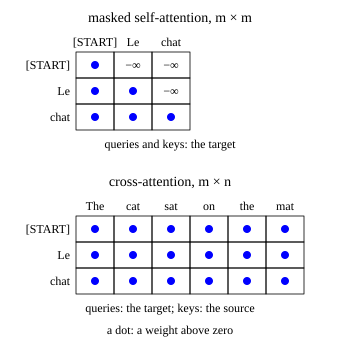

::: card
The target has token indices $\mathbf{s} = [s_1, \ldots, s_m]$. Embed them and add the
positional encoding, exactly as in the encoder, to get
$\mathbf{Y}^{(0)} \in \mathbb{R}^{m \times d_{model}}$. In training the whole target goes in at
once, shifted right by a [START] token. This is **teacher forcing**: each position predicts the
next true token from the true tokens before it.
:::

::: card
The first sub-layer is self-attention with a causal mask
$\mathbf{M} \in \mathbb{R}^{m \times m}$, added to the scores before the
softmax.[Causal mask](reference:causal-mask)

$$ M_{ij} = \begin{cases} 0 & j \le i \\ -\infty & j > i \end{cases} \qquad \mathbf{S}_k = \frac{\mathbf{Q}_k\mathbf{K}_k^T}{\sqrt{d_k}} + \mathbf{M} \in \mathbb{R}^{m \times m} $$
:::

::: card
Where $j > i$ the score is $-\infty$, and $\exp(-\infty) = 0$, so $A_{k,ij} = 0$. Position $i$
reads positions $1, \ldots, i$ and nothing after. The model cannot peek at the token it must
predict. Concatenate the heads, project, add the residual and normalize, to get
$\tilde{\mathbf{Y}}^{(1)} \in \mathbb{R}^{m \times d_{model}}$.
:::

::: card
The second sub-layer is **cross-attention**. The queries come from the decoder; the keys and
the values come from the encoder output $\mathbf{X}_{enc}$.[Cross-attention](reference:cross-attention)

$$ \mathbf{Q}_k = \tilde{\mathbf{Y}}^{(1)}\mathbf{W}_k^Q \in \mathbb{R}^{m \times d_k}, \qquad \mathbf{K}_k = \mathbf{X}_{enc}\mathbf{W}_k^K, \;\; \mathbf{V}_k = \mathbf{X}_{enc}\mathbf{W}_k^V \in \mathbb{R}^{n \times d_k} $$
:::

::: card
The score matrix is no longer square. Its rows are the $m$ target positions and its columns
the $n$ source positions:

$$ \mathbf{S}_k = \frac{\mathbf{Q}_k\mathbf{K}_k^T}{\sqrt{d_k}} \in \mathbb{R}^{m \times n}, \quad \mathbf{A}_k = \mathrm{softmax}(\mathbf{S}_k), \quad \mathbf{H}_k = \mathbf{A}_k\mathbf{V}_k \in \mathbb{R}^{m \times d_k} $$

Compare the two shapes in [Figure](figure:decoder-attention-shapes).
:::

::: figure decoder-attention-shapes

Top: masked self-attention over the target, $m \times m$, with the future set to $-\infty$.
Bottom: cross-attention from the target to the source, $m \times n$, with no mask.
:::

::: card
Cross-attention takes no mask. The source sentence is known in full before the decoder starts,
so reading all of it leaks nothing about the target. When the decoder writes "chat", its query
lands on the key of "cat"; when it writes "assis", on "sat". It learns these alignments from
the translation loss alone.
:::

::: card
The third sub-layer is the same position-wise feed-forward network as in the encoder. Each of
the three sub-layers has its residual and its layer norm. The decoder stacks $N$ layers, and
every one of them reads the same final encoder output:

$$ \mathbf{Y}^{(\ell)} = \mathrm{DecoderBlock}_\ell\big(\mathbf{Y}^{(\ell-1)}, \mathbf{X}_{enc}\big), \qquad \mathbf{Y}_{dec} = \mathbf{Y}^{(N)} \in \mathbb{R}^{m \times d_{model}} $$
:::

::: exercise masked-row-weights
In one head of masked self-attention, row $i = 2$ of the scaled scores is $[1, 2, 5]$ before
the mask. What are the attention weights of that row?

::: answer
$[0.269, 0.731, 0]$. The mask sends the third score to $-\infty$; take the softmax of the
first two.
:::

::: solution
The mask adds $-\infty$ at $j = 3 > 2$: the row becomes $[1, 2, -\infty]$.

$$ a_1 = \frac{e^1}{e^1 + e^2} = \frac{1}{1 + e} = 0.269 $$

$$ a_2 = \frac{e^2}{e^1 + e^2} = \frac{e}{1 + e} = 0.731, \qquad a_3 = 0 $$

∎
:::
:::

::: exercise cross-attention-shape
The source has $n = 7$ tokens, the target $m = 4$, and $d_k = 64$. What are the shapes of one
head's $\mathbf{K}_k$ and of its weights $\mathbf{A}_k$ in cross-attention?

::: answer
$\mathbf{K}_k$ is $7 \times 64$ and $\mathbf{A}_k$ is $4 \times 7$. Keys come from the source;
the weights pair each target row with each source column.
:::
:::

::: exercise causal-weights-count
In masked self-attention over $m = 5$ target positions, how many entries of one head's
$\mathbf{A}_k$ can be above zero?

::: answer
15. Row $i$ has $i$ allowed entries, so the count is $1 + 2 + 3 + 4 + 5$.
:::

::: solution
$$ \sum_{i=1}^{5} i = \frac{5 \cdot 6}{2} = 15 $$

The other $25 - 15 = 10$ entries are zero. ∎
:::
:::

::: reference cross-attention
# Cross-attention

Attention whose queries come from one sequence and whose keys and values come from another.
In the transformer the decoder asks and the encoder output answers.

::: equation
\mathrm{CrossAttn}(\mathbf{Y}, \mathbf{X}_{enc}) = \mathrm{softmax}\!\left(\frac{(\mathbf{Y}\mathbf{W}^Q)(\mathbf{X}_{enc}\mathbf{W}^K)^T}{\sqrt{d_k}}\right)\mathbf{X}_{enc}\mathbf{W}^V
:::

::: legend
$\mathbf{Y}$: the decoder rows, $m \times d_{model}$
$\mathbf{X}_{enc}$: the encoder output, $n \times d_{model}$
$\mathbf{W}^Q, \mathbf{W}^K, \mathbf{W}^V$: the projections of one head, $d_{model} \times d_k$
$d_k$: the size of one head
:::

::: derivation
Goal: the shapes, and the output has one row per decoder position.
$\mathbf{Y}\mathbf{W}^Q$ is $m \times d_k$; $\mathbf{X}_{enc}\mathbf{W}^K$ and $\mathbf{X}_{enc}\mathbf{W}^V$ are $n \times d_k$.
The scores $(m \times d_k)(d_k \times n)$ are $m \times n$.[Scaled dot-product attention](reference:scaled-dot-product-attention)
The softmax runs along each row, over the $n$ source positions.[Attention weights](reference:attention-weights)
The weights times the values, $(m \times n)(n \times d_k)$, give $m \times d_k$. ∎
:::
:::

::: reference transformer-decoder-layer
# The decoder layer

A decoder layer has three sub-layers: masked self-attention, cross-attention to the encoder
output, and a feed-forward network. Each is wrapped in a residual and a layer norm.

::: equation
\begin{aligned}
\tilde{\mathbf{Y}}^{(1)} &= \mathrm{LN}_1\big(\mathbf{Y} + \mathrm{MHA}(\mathbf{Y}; \mathbf{M})\big) \\
\tilde{\mathbf{Y}}^{(2)} &= \mathrm{LN}_2\big(\tilde{\mathbf{Y}}^{(1)} + \mathrm{CrossAttn}(\tilde{\mathbf{Y}}^{(1)}, \mathbf{X}_{enc})\big) \\
\mathbf{Y}' &= \mathrm{LN}_3\big(\tilde{\mathbf{Y}}^{(2)} + \mathrm{FFN}(\tilde{\mathbf{Y}}^{(2)})\big)
\end{aligned}
:::

::: legend
$\mathbf{Y}$: the layer input, $m \times d_{model}$
$\mathbf{M}$: the causal mask, $m \times m$
$\mathbf{X}_{enc}$: the final encoder output, $n \times d_{model}$
$\mathbf{Y}'$: the layer output, $m \times d_{model}$
:::

::: derivation
Goal: the output has the shape of the input, and position $i$ depends on no target position after $i$.
Masked self-attention keeps $m \times d_{model}$, as the encoder layer does.[Encoder layer](reference:transformer-encoder-layer)
The mask zeroes $A_{ij}$ for $j > i$, so row $i$ mixes target rows $1, \ldots, i$ only.[Causal mask](reference:causal-mask)
Cross-attention returns one row per decoder position, $m \times d_{model}$ after $\mathbf{W}^O$.[Cross-attention](reference:cross-attention)
It mixes source rows only, so it adds no dependence on later target rows.
The FFN, the sums and the norms act row by row, and keep both properties. ∎
:::
:::
