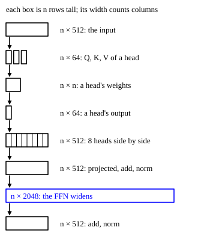

::: card
The source has token indices $\mathbf{t} = [t_1, \ldots, t_n]$, each in $\{1, \ldots, V\}$.
Take row $t_i$ of the embedding matrix $\mathbf{E} \in \mathbb{R}^{V \times d_{model}}$ for each
position, and add the positional encoding $\mathbf{P}$.[Sinusoidal encoding](reference:sinusoidal-encoding)

$$ \mathbf{X}^{(0)} = \mathbf{E}[\mathbf{t}, :] + \mathbf{P} \in \mathbb{R}^{n \times d_{model}} $$
:::

::: card
The shapes through one layer are in [Figure](figure:encoder-layer-shapes). Watch the width: it
splits into heads, comes back to $512$, swells to $2048$ inside the feed-forward network, and
returns to $512$.
:::

::: figure encoder-layer-shapes

The matrices of one encoder layer with $d_{model} = 512$, $h = 8$ and $d_{ff} = 2048$. Every
matrix has $n$ rows, one per position. The blue box is the wide hidden layer of the
feed-forward network.
:::

::: card
For each head $k \in \{1, \ldots, h\}$, three learned matrices
$\mathbf{W}_k^Q, \mathbf{W}_k^K, \mathbf{W}_k^V \in \mathbb{R}^{d_{model} \times d_k}$ project the
layer input $\mathbf{X}$:

$$ \mathbf{Q}_k = \mathbf{X}\mathbf{W}_k^Q, \quad \mathbf{K}_k = \mathbf{X}\mathbf{W}_k^K, \quad \mathbf{V}_k = \mathbf{X}\mathbf{W}_k^V \in \mathbb{R}^{n \times d_k} $$
:::

::: card
Each head scores every pair of positions, then takes a softmax along each row, so each row
sums to 1.[Scaled dot-product attention](reference:scaled-dot-product-attention)

$$ \mathbf{S}_k = \frac{\mathbf{Q}_k \mathbf{K}_k^T}{\sqrt{d_k}} \in \mathbb{R}^{n \times n}, \qquad A_{k,ij} = \frac{\exp(S_{k,ij})}{\sum_{j'=1}^{n} \exp(S_{k,ij'})} $$

Entry $S_{k,ij}$ says how well position $i$ matches position $j$.
:::

::: card
Each head averages the value rows with its weights, $\mathbf{H}_k = \mathbf{A}_k\mathbf{V}_k \in \mathbb{R}^{n \times d_k}$.
The $h$ heads sit side by side, and $\mathbf{W}^O \in \mathbb{R}^{d_{model} \times d_{model}}$
mixes them.[Multi-head attention](reference:multi-head-attention)

$$ \mathbf{Z}^{attn} = [\mathbf{H}_1 \,|\, \cdots \,|\, \mathbf{H}_h]\,\mathbf{W}^O \in \mathbb{R}^{n \times d_{model}} $$
:::

::: card
Add the input back, then normalize each row across its $d_{model}$ entries with learned
$\gamma^{(1)}, \beta^{(1)} \in \mathbb{R}^{d_{model}}$.[Residual connection](reference:residual-connection)
[Layer normalization](reference:layer-normalization)

$$ \mathbf{R}^{(1)} = \mathbf{X} + \mathbf{Z}^{attn}, \qquad \tilde{x}_{ij} = \gamma^{(1)}_j \frac{r_{ij} - \mu_i}{\sqrt{\sigma_i^2 + \epsilon}} + \beta^{(1)}_j $$

Here $\mu_i$ and $\sigma_i^2$ are the mean and the variance of row $i$ of $\mathbf{R}^{(1)}$.
:::

::: card
The feed-forward network works on each row alone. With
$\mathbf{W}_1 \in \mathbb{R}^{d_{ff} \times d_{model}}$ and
$\mathbf{W}_2 \in \mathbb{R}^{d_{model} \times d_{ff}}$, and $\mathbf{1}_n$ a column of $n$
ones:[Feed-forward network](reference:feed-forward-network)

$$ \mathbf{F} = \mathrm{ReLU}\big(\tilde{\mathbf{X}}\mathbf{W}_1^T + \mathbf{1}_n\mathbf{b}_1^T\big) \in \mathbb{R}^{n \times d_{ff}}, \qquad \mathbf{Z}^{ffn} = \mathbf{F}\mathbf{W}_2^T + \mathbf{1}_n\mathbf{b}_2^T $$
:::

::: card
A second residual and a second layer norm, with $\gamma^{(2)}, \beta^{(2)}$, close the
layer:

$$ \mathbf{X}^{(\ell)} = \mathrm{LN}_2\big(\tilde{\mathbf{X}} + \mathbf{Z}^{ffn}\big) \in \mathbb{R}^{n \times d_{model}} $$

The output has the shape of the input. That is what lets $N$ layers run in a row.[Encoder layer](reference:transformer-encoder-layer)
:::

::: card
Run $N$ layers, each with its own weights:

$$ \mathbf{X}^{(\ell)} = \mathrm{EncoderBlock}_\ell\big(\mathbf{X}^{(\ell-1)}\big), \quad \ell = 1, \ldots, N $$

The last output, $\mathbf{X}_{enc} = \mathbf{X}^{(N)} \in \mathbb{R}^{n \times d_{model}}$, is
what the decoder reads. Early layers tend to catch local patterns and syntax, deep layers
longer-range meaning.
:::

::: exercise score-matrix-shape
A source of $n = 10$ tokens enters the base encoder. What is the shape of one head's score
matrix $\mathbf{S}_k$, and of the hidden matrix $\mathbf{F}$ of the feed-forward network?

::: answer
$\mathbf{S}_k$ is $10 \times 10$ and $\mathbf{F}$ is $10 \times 2048$. Scores pair positions; the
hidden layer has $d_{ff}$ columns.
:::
:::

::: exercise attention-weights-per-layer
A source of $n = 6$ tokens enters one encoder layer with $h = 8$ heads. How many attention
weights does the layer compute?

::: answer
288. Each head holds an $n \times n$ matrix.
:::

::: solution
One head: $n^2 = 6^2 = 36$ weights.

Eight heads: $8 \times 36 = 288$. ∎
:::
:::

::: exercise layer-norm-one-row
A row of $\mathbf{R}^{(1)}$, shortened to $4$ entries, is $[2, 4, 4, 6]$. Take $\gamma = 1$,
$\beta = 0$ and let $\epsilon \to 0$. What does the layer norm return?

::: answer
$[-1.414, 0, 0, 1.414]$. Subtract the mean 4, divide by the standard deviation $\sqrt{2}$.
:::

::: solution
$$ \mu = \frac{2 + 4 + 4 + 6}{4} = 4 $$

$$ \sigma^2 = \frac{4 + 0 + 0 + 4}{4} = 2, \qquad \sigma = 1.414 $$

$$ \hat{\mathbf{r}} = \frac{[-2, 0, 0, 2]}{1.414} = [-1.414, 0, 0, 1.414] $$

∎
:::
:::

::: reference transformer-encoder-layer
# The encoder layer

An encoder layer maps $n$ rows of size $d_{model}$ to $n$ rows of size $d_{model}$: multi-head
self-attention, then a feed-forward network, each wrapped in a residual and a layer norm.

::: equation
\tilde{\mathbf{X}} = \mathrm{LN}_1\big(\mathbf{X} + \mathrm{MHA}(\mathbf{X})\big), \qquad
\mathbf{X}' = \mathrm{LN}_2\big(\tilde{\mathbf{X}} + \mathrm{FFN}(\tilde{\mathbf{X}})\big)
:::

::: legend
$\mathbf{X}$: the layer input, $n \times d_{model}$
$\mathrm{MHA}$: multi-head self-attention, with no mask
$\mathrm{LN}_1, \mathrm{LN}_2$: layer norms with their own $\gamma$ and $\beta$
$\mathrm{FFN}$: the position-wise feed-forward network
$\mathbf{X}'$: the layer output, $n \times d_{model}$
:::

::: derivation
Goal: the output has the shape of the input.
Each head gives $\mathbf{A}_k\mathbf{V}_k$: $(n \times n)(n \times d_k) = n \times d_k$.[Multi-head attention](reference:multi-head-attention)
The $h$ heads side by side: $n \times h d_k = n \times d_{model}$.
$\mathbf{W}^O$ is $d_{model} \times d_{model}$, so $\mathrm{MHA}(\mathbf{X})$ is $n \times d_{model}$.
The sum $\mathbf{X} + \mathrm{MHA}(\mathbf{X})$ is defined, since both are $n \times d_{model}$.[Residual connection](reference:residual-connection)
The layer norm acts row by row and keeps the shape.[Layer normalization](reference:layer-normalization)
The FFN maps $n \times d_{model}$ to $n \times d_{ff}$ and back to $n \times d_{model}$.[Feed-forward network](reference:feed-forward-network)
The second sum and norm keep $n \times d_{model}$. ∎
:::
:::
