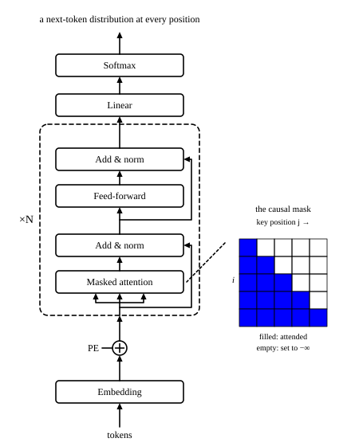

::: card
The encoder and the decoder also work alone. A **decoder-only** model, the GPT family, drops the
encoder and the cross-attention. Each block keeps two sub-layers: masked self-attention and the
FFN, each with its residual and its norm. Its input is the text so far, and it predicts the next
token at every position ([Figure](figure:decoder-only-block)).
:::

::: figure decoder-only-block

One stack of $N$ blocks of masked attention and feed-forward. The causal mask lets each position
read only itself and the positions before it.
:::

::: card
Without a separate source, a task becomes text to continue. Translation is "English: The cat sat.
French:", and the model writes what comes next. The causal mask is what makes generation work:
the model was trained never to see the future, so it can produce the future one token at a time.
:::

::: card
An **encoder-only** model, the BERT family, keeps the encoder and drops the decoder. Attention has
no mask: every token sees the whole input, left and right. This **bidirectional** view suits tasks
that read a whole text, such as classifying it or labelling each of its tokens.
:::

::: card
On top of the encoder sits a small task head in place of the vocabulary projection. To classify a
sentence, BERT puts a special token [CLS] first, and a linear classifier reads the final vector of
that token. Encoder-only models do not generate text: with no mask, they never learned to predict
from the past alone.
:::

::: card
Forward and backward passes need nothing new. A decoder-only block is the decoder layer without
its middle sub-layer. An encoder-only block is the encoder layer. The equations of the earlier
decks apply as they stand.
:::

::: exercise q1
Which sub-layer does a GPT block lack, compared with a decoder layer of the original transformer?

::: answer
Cross-attention. With no encoder, there is nothing to attend across to.
:::
:::

::: exercise q2
Why can BERT not generate text one token at a time?

::: answer
Its attention has no causal mask: every token sees every other one, so it never learned to predict
a token from the tokens before it alone.
:::
:::
