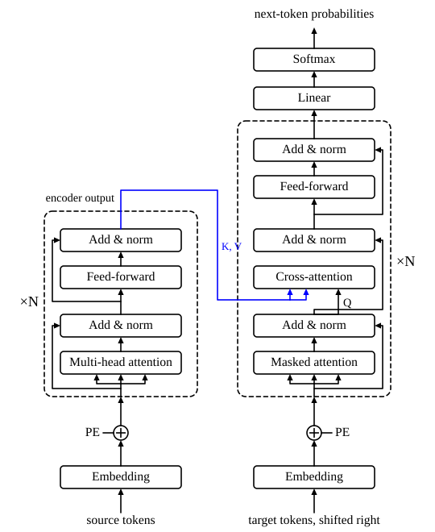

::: card
Give the transformer the English sentence "The cat sat on the mat" and it writes the French
"Le chat s'est assis sur le tapis". Two parts share the work. An **encoder** reads the whole
source sentence. A **decoder** writes the target sentence, one token at a time.
:::

::: card
A recurrent network squeezes the whole source into one fixed-size state before the decoder
sees it.[RNN update](reference:rnn-update) The transformer keeps one vector per position, and
attention lets every position read every other position directly. Nothing is squeezed through a
single vector, and all positions are computed at once instead of one after another.
:::

::: card
The full machine, from the tokens at the bottom to the next-token probabilities at the top, is
in [Figure](figure:encoder-decoder). The left column is the encoder, the right column the
decoder. The blue path is the one place where they meet.
:::

::: figure encoder-decoder

The encoder (left) and the decoder (right), each a stack of $N$ identical layers. Every
sub-layer has a residual path around it and a layer norm after it. The encoder output feeds the
keys and values of every cross-attention in the decoder.
:::

::: card
A token arrives as an index into the vocabulary. The embedding matrix turns it into a row of
$d_{model} = 512$ numbers.[Embedding lookup](reference:embedding-lookup) The rows hold no order:
"dog bites man" and "man bites dog" give the same set of vectors. So each position adds its own
sinusoidal signature, and "cat" at position 2 differs from "cat" at position
5.[Sinusoidal encoding](reference:sinusoidal-encoding)
:::

::: card
The encoder is a stack of $N = 6$ identical layers. Each layer runs multi-head self-attention,
which mixes information across positions, then a feed-forward network, which works on each
position alone. A residual path and a layer norm wrap each of the two. Every layer keeps the
shape $n \times d_{model}$, so the layers stack.
:::

::: card
A decoder layer has three sub-layers. Masked self-attention lets a target position see only
the positions before it. Cross-attention lets it read the encoder output. A feed-forward
network then refines each position. The decoder also stacks $N = 6$ layers.
:::

::: card
On top of the decoder, a linear layer maps each $512$-number row to $V = 50000$ scores, one for
each token of the vocabulary. A softmax turns the scores into a probability distribution over
the next token.
:::

::: card
The base model fixes these sizes:

- $V = 50000$ tokens in the vocabulary;
- $d_{model} = 512$ numbers in every hidden vector;
- $h = 8$ heads, each of size $d_k = d_v = d_{model}/h = 64$;
- $d_{ff} = 2048$ in the hidden layer of the feed-forward network;
- $N = 6$ layers in the encoder and $6$ in the decoder;
- $n$ source tokens, $m$ target tokens, and $\epsilon = 10^{-6}$ in each layer norm.
:::

::: card
Follow "The cat" into "Le chat". The encoder turns "The" and "cat" into two context-rich
vectors. The decoder reads [START], "Le", "chat". From [START] it should predict "Le", from
"Le" it should predict "chat", and from "chat" it should predict [END]. Cross-attention links
"Le" to "The" and "chat" to "cat", and nobody tells it to.
:::

::: exercise heads-and-head-size
A transformer has $d_{model} = 768$ and $h = 12$ heads. What is the size $d_k$ of one head?

::: answer
$d_k = 64$. Split the model dimension evenly across the heads.
:::

::: solution
$$ d_k = \frac{d_{model}}{h} = \frac{768}{12} = 64 $$

∎
:::
:::

::: exercise why-positions-are-added
Without positional encoding, the encoder output for "dog bites man" holds the same set of
vectors as the one for "man bites dog". Why?

::: answer
The embeddings carry no position, and self-attention treats its inputs as a set: permute the
input rows and the output rows permute the same way.
:::
:::

::: exercise predictions-per-target
The decoder reads the $m = 4$ target tokens [START], "Le", "chat", "dort". How many
probability distributions over the vocabulary does one forward pass produce?

::: answer
4, one for each target position. Each predicts the token that follows it.
:::
:::
