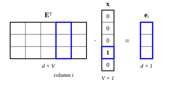

::: card
A *word embedding* maps each word to a dense vector. Instead of 50,000 entries with a single 1,
the vector has perhaps 256 or 512 entries, all of them real numbers, and the network learns them
from data.
:::

::: card
All the embeddings sit in one matrix, $\mathbf{E} \in \mathbb{R}^{V \times d}$. $V$ is the
vocabulary size, for example 50,000, and $d$ is the embedding dimension, for example 256.

Row $i$ of $\mathbf{E}$ holds the embedding of word $i$. If "cat" has index 3142, row 3142 of
$\mathbf{E}$ is the vector for "cat".
:::

::: card
To look up an embedding, you take row $i$ of $\mathbf{E}$. As a [matrix product](reference:matrix-vector-product)
with the one-hot vector $\mathbf{x} \in \mathbb{R}^V$ of word $i$, the
[lookup](reference:embedding-lookup) reads

$$ \mathbf{e}_i = \mathbf{E}^T \mathbf{x} $$

Here $\mathbf{E}^T \in \mathbb{R}^{d \times V}$ and $\mathbf{e}_i \in \mathbb{R}^d$.
:::

::: card
The product works because $\mathbf{E}^T \mathbf{x}$ is a weighted sum of the columns of
$\mathbf{E}^T$, with the entries of $\mathbf{x}$ as the weights. Every weight is zero except
the one at position $i$. So the product selects column $i$ of $\mathbf{E}^T$, which is row $i$ of
$\mathbf{E}$ ([Figure](figure:embedding-lookup)).
:::

::: figure embedding-lookup


The single 1 in $\mathbf{x}$ switches on column $i$ of $\mathbf{E}^T$. Every other column is
multiplied by zero, and the result is the embedding $\mathbf{e}_i$.
:::

::: card
In practice nobody multiplies by a one-hot vector: the code reads row $i$ directly. The product
form matters for training. With $\mathbf{g} = \frac{\partial L}{\partial \mathbf{e}_i}$, the
gradient of the loss with respect to the matrix is

$$ \frac{\partial L}{\partial \mathbf{E}} = \mathbf{x}\, \mathbf{g}^T $$

This outer product is zero everywhere except row $i$. A training step changes only the
embeddings of the words in the input.
:::

::: card
Take a tiny vocabulary of 5 words with $d = 3$. In the order cat, dog, fish, car, truck, with
indices 0 to 4, the embedding matrix is

$$
\mathbf{E} = \begin{bmatrix}
0.2 & 0.8 & -0.1 \\
0.3 & 0.7 & -0.2 \\
0.1 & 0.9 & 0.3 \\
-0.5 & 0.1 & 0.6 \\
-0.4 & 0.2 & 0.5
\end{bmatrix}
$$
:::

::: card
"Cat" and "dog" get similar rows, and so do "car" and "truck". Plot the first two coordinates
of each row and the animals sit together at the top right, the vehicles at the left. The space
holds the relation between the words.

```plot
x: { var: x, label: "first coordinate", from: -0.7, to: 0.5, ticks: 0.1, grid: true }
y: { label: "second coordinate", from: 0, to: 1 }

draw:
  - vline: { at: 0 }
  - point: { at: [0.2, 0.8], label: cat }
  - point: { at: [0.3, 0.7], label: dog }
  - point: { at: [0.1, 0.9], label: fish }
  - point: { at: [-0.5, 0.1], label: car }
  - point: { at: [-0.4, 0.2], label: truck }
```
:::

::: exercise embedding-matrix-size
An embedding matrix serves 50,000 words with $d = 256$. How many parameters does it hold?

::: answer
12,800,000. The matrix has $V \times d$ entries.
:::

::: solution
$$ V \times d = 50{,}000 \times 256 = 12{,}800{,}000 $$

∎
:::
:::

::: exercise embedding-lookup-product
With the five-word matrix $\mathbf{E}$ of this deck, compute $\mathbf{E}^T \mathbf{x}$ for
$\mathbf{x} = [0, 0, 0, 1, 0]^T$. Which word is it?

::: answer
$[-0.5, 0.1, 0.6]^T$, the embedding of "car". The 1 sits at index 3, so the product returns row 3.
:::

::: solution
Entry $k$ of the product is $\sum_j E_{jk} x_j$. Only $x_3 = 1$ is nonzero.

$$ (\mathbf{E}^T \mathbf{x})_k = E_{3k} $$

$$ \mathbf{E}^T \mathbf{x} = [-0.5,\ 0.1,\ 0.6]^T $$

Row 3 belongs to "car". ∎
:::
:::

::: exercise embedding-gradient-rows
A training example contains only word 7. Which rows of $\mathbf{E}$ get a nonzero gradient from
the embedding lookup?

::: answer
Only row 7. The gradient $\mathbf{x}\,\mathbf{g}^T$ is zero in every row where $\mathbf{x}$ is zero.
:::
:::

::: reference embedding-lookup
# Embedding lookup

The embedding of word $i$ is row $i$ of the embedding matrix. As a product, it is the transposed
matrix times the one-hot vector of the word.

::: equation
\mathbf{e}_i = \mathbf{E}^T \mathbf{x}, \qquad \mathbf{E} \in \mathbb{R}^{V \times d},\ \mathbf{x} \in \mathbb{R}^V,\ \mathbf{e}_i \in \mathbb{R}^d
:::

::: legend
$\mathbf{e}_i$: the embedding of word $i$
$\mathbf{E}$: the embedding matrix, one row per word
$\mathbf{x}$: the one-hot vector of word $i$
$V$: the vocabulary size
$d$: the embedding dimension
:::

::: derivation
Entry $k$ of the product: $(\mathbf{E}^T \mathbf{x})_k = \sum_{j=1}^{V} E_{jk}\, x_j$.[Matrix-vector product](reference:matrix-vector-product)
The one-hot vector has $x_j = 1$ for $j = i$ and $x_j = 0$ otherwise.
Only the term $j = i$ survives: $(\mathbf{E}^T \mathbf{x})_k = E_{ik}$.
For every $k$ this is entry $k$ of row $i$, so $\mathbf{E}^T \mathbf{x}$ is row $i$ of $\mathbf{E}$. ∎
:::
:::
