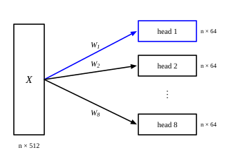

::: card
A token vector in a transformer has width $d_\text{model}$, often 512 or 768. Treat that width as
capacity: 512 numbers available to carry what the model knows about the token.
:::

::: card
A simple question, such as whether a word is the subject or the object, does not need all 512
numbers. A space of 64 numbers can be enough to answer it.
:::

::: card
So divide the capacity. In place of one head that works in 512 dimensions, use $h = 8$ heads,
each working in $d_k = 64$ dimensions.

$$ d_k = \frac{d_\text{model}}{h} = \frac{512}{8} = 64 $$
:::

::: card
The heads do not chop the input. Head 1 does not read coordinates 1 to 64 while head 2 reads the
next 64. Every head reads the whole 512-wide vector, then compresses it to 64 numbers with its
own learned matrices ([Figure](figure:head-split)).
:::

::: figure head-split

The input $X$ holds one 512-wide row per token. Each head multiplies all of it by its own
matrices $W_i$ and keeps 64 numbers per token.
:::

::: card
Chopping fails for a simple reason. If head 1 saw only coordinates 1 to 64, a feature stored in
coordinates 65 to 512 would be invisible to it. A learned projection lets each head take the
directions it needs from anywhere in the vector.
:::

::: exercise q1
A model has $d_\text{model} = 768$ and $h = 12$ heads. What is the width $d_k$ of each head?

::: answer
64. Divide the model width by the number of heads.
:::

::: solution
$$ d_k = \frac{768}{12} = 64 $$

∎
:::
:::

::: exercise q2
A model has $d_\text{model} = 1024$ and heads of width $d_k = 128$. How many heads does it have?

::: answer
8. The heads share the model width: $h = d_\text{model} / d_k$.
:::

::: solution
$$ h = \frac{1024}{128} = 8 $$

∎
:::
:::

::: exercise q3
In a model with $d_\text{model} = 512$ and 8 heads, how many of the 512 input coordinates does
head 3 read?

::: answer
All 512. Every head reads the whole vector and projects it down to its own 64 numbers.
:::
:::
