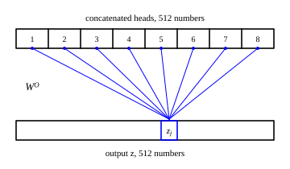

::: card
The last step multiplies the concatenation by one more learned matrix, $\mathbf{W}^O$, of size
$512 \times 512$.

$$ \mathbf{Z} = \text{Concat}(\text{head}_1, \dots, \text{head}_8)\, \mathbf{W}^O $$
:::

::: card
Look at one output number. Write $\mathbf{c} = (c_1, \dots, c_{512})$ for the concatenated vector
of one token and $\mathbf{z} = (z_1, \dots, z_{512})$ for its output. Output number $j$ is

$$ z_j = \sum_{i=1}^{512} c_i\, W^O_{ij} $$
:::

::: card
The sum runs over the whole concatenated vector. Indices 1 to 64 come from head 1, indices 65
to 128 from head 2, and so on to head 8. So every $z_j$ is a weighted sum of all the heads at
once ([Figure](figure:head-mixing)).
:::

::: figure head-mixing

Each output number $z_j$ draws on all 8 blocks of the concatenated vector, through column $j$ of
$\mathbf{W}^O$.
:::

::: card
$\mathbf{W}^O$ works like a mixing desk. Output number 5 may take 0.2 of a grammar signal from
head 1, add 0.5 of a meaning signal from head 2, and subtract 0.1 of a position signal from head
3. Now one number can hold "river banks".
:::

::: card
$\mathbf{W}^O$ holds $512 \times 512 = 262{,}144$ numbers. They start small and random.
Backpropagation adjusts them after each prediction error.[Backpropagation](reference:backpropagation)
Over many examples, $\mathbf{W}^O$ learns which heads carry what each output needs.
:::

::: card
Put the steps together and you have the full layer: project, attend in each head, concatenate,
mix.[Multi-head attention](reference:multi-head-attention)

$$ \text{MultiHead}(\mathbf{X}) = \text{Concat}(\text{head}_1, \dots, \text{head}_h)\, \mathbf{W}^O $$
:::

::: exercise q1
Two heads of width 2 give the concatenated vector $\mathbf{c} = (1, 2, 3, 4)$. The first column of
$\mathbf{W}^O$ is $(0.5, 0, 0, 0.5)^\top$. What is $z_1$?

::: answer
2.5. Multiply each $c_i$ by $W^O_{i1}$ and add.
:::

::: solution
$$ z_1 = 1 \times 0.5 + 2 \times 0 + 3 \times 0 + 4 \times 0.5 $$

$$ z_1 = 0.5 + 2 = 2.5 $$

∎
:::
:::

::: exercise q2
A model has $d_\text{model} = 768$. How many numbers does $\mathbf{W}^O$ hold?

::: answer
589,824. $\mathbf{W}^O$ is $768 \times 768$.
:::

::: solution
$$ 768 \times 768 = 589{,}824 $$

∎
:::
:::

::: exercise q3
In a layer with 8 heads, the column of $\mathbf{W}^O$ for output number 7 has no zero entry. From
how many heads does $z_7$ draw?

::: answer
All 8. The sum for $z_7$ runs over every coordinate of the concatenated vector.
:::
:::

::: reference multi-head-attention
# Multi-head attention

Each of $h$ heads projects the input with its own matrices and runs scaled dot-product attention
in $d_k = d_\text{model}/h$ dimensions. The heads are joined side by side and mixed by one output
matrix.

::: equation
\text{MultiHead}(\mathbf{X}) = \text{Concat}(\text{head}_1, \dots, \text{head}_h)\,\mathbf{W}^O
\qquad
\text{head}_i = \text{softmax}\left(\frac{\mathbf{X}\mathbf{W}_i^Q \left(\mathbf{X}\mathbf{W}_i^K\right)^\top}{\sqrt{d_k}}\right)\mathbf{X}\mathbf{W}_i^V
:::

::: legend
$\mathbf{X}$: the input, one row per token, $n \times d_\text{model}$
$h$: the number of heads
$d_k$: the width of each head, $d_\text{model}/h$
$\mathbf{W}_i^Q, \mathbf{W}_i^K, \mathbf{W}_i^V$: the projections of head $i$, each $d_\text{model} \times d_k$
$\text{head}_i$: the output of head $i$, $n \times d_k$
$\mathbf{W}^O$: the output matrix, $h d_k \times d_\text{model}$
:::

::: derivation
Each projection is $(n \times d_\text{model})(d_\text{model} \times d_k)$, so $\mathbf{Q}_i$, $\mathbf{K}_i$ and $\mathbf{V}_i$ are $n \times d_k$.[Matrix product](reference:matrix-product)
$\mathbf{Q}_i \mathbf{K}_i^\top$ is $n \times n$; the row softmax keeps that shape.[Scaled dot-product attention](reference:scaled-dot-product-attention)
$(n \times n)(n \times d_k)$ gives $\text{head}_i$ of shape $n \times d_k$.
Joining $h$ heads column by column gives $n \times h d_k = n \times d_\text{model}$.
$(n \times d_\text{model})(d_\text{model} \times d_\text{model})$ gives an output of shape $n \times d_\text{model}$, the shape of the input. ∎
:::
:::
