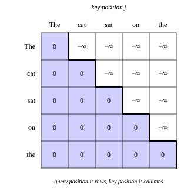

::: card
A language model learns to predict the next token. Train it on "The cat sat on the mat": the input
is "The cat sat on the", and the targets are "cat sat on the mat", one per position. Plain
self-attention lets position 3, "sat", attend to positions 4 and 5. It can see the answer it is
supposed to predict.
:::

::: card
A model that can see the future learns a shortcut: copy the next token. It learns no grammar and no
facts. Then, when it generates text, the future does not exist yet, and the shortcut fails. So
position $i$ may only see positions $1, \ldots, i$: the past and itself.
:::

::: card
**Causal self-attention** enforces this on the scores, before the softmax:

$$ s_{ij} = \begin{cases} \mathbf{q}_i^T\mathbf{k}_j / \sqrt{d_k} & j \le i \\ -\infty & j > i \end{cases} $$

Since $e^{-\infty} = 0$, every future position gets a weight of exactly zero. It vanishes from the
weighted sum ([causal mask](reference:causal-mask)).
:::

::: card
In practice you add a **mask matrix** $\mathbf{M}$, zero on and below the diagonal and $-\infty$
above it, and compute $\mathbf{A} = \mathrm{softmax}(\mathbf{S} + \mathbf{M})$. Row 1 sees only
column 1; row 4 sees columns 1 to 4. The attention matrix becomes **lower triangular**
([Figure](figure:causal-mask)).
:::

::: figure causal-mask


The mask for five tokens. Shaded cells add 0 and keep their score. The others add $-\infty$ and
get a weight of zero.
:::

::: card
One row of weights, for the query at position $i$. The five keys have fixed scores
$[1.0, 0.2, 0.5, 1.5, 0.3]$. Move $i$: the weights spread over positions $1$ to $i$ only, and they
still add to 1. Everything to the right of $i$ stays at zero.

```plot
x: { var: t, label: "key position j", from: 0.4, to: 5.6, ticks: 1 }
y: { label: "weight", from: 0, to: 1, ticks: 0.25, grid: true }

inputs:
  - { name: i, min: 1, max: 5, default: 3, step: 1, label: "query position i" }

let:
  e1: exp(1.0)
  e2: (i >= 2) * exp(0.2)
  e3: (i >= 3) * exp(0.5)
  e4: (i >= 4) * exp(1.5)
  e5: (i >= 5) * exp(0.3)
  z: e1 + e2 + e3 + e4 + e5

draw:
  - vline: { at: i + 0.5, dash: true }
  - area: { under: e1 / z, over: [0.7, 1.3], accent: true }
  - area: { under: e2 / z, over: [1.7, 2.3], accent: true }
  - area: { under: e3 / z, over: [2.7, 3.3], accent: true }
  - area: { under: e4 / z, over: [3.7, 4.3], accent: true }
  - area: { under: e5 / z, over: [4.7, 5.3], accent: true }
```
:::

::: card
The mask makes training parallel. One forward pass computes the predictions at every position
at once, and the mask guarantees that none of them used the token it predicts. GPT and every other
decoder-only model is built on this.
:::

::: exercise q1
For a sequence of 6 tokens, how many entries of the mask are $-\infty$?

::: answer
15. The entries above the diagonal: $6 \cdot 5 / 2$.
:::
:::

::: exercise q2
Row 2 has the scores $[\ln 3, 0, 5]$ before the mask. What are its weights after it?

::: answer
$[0.75, 0.25, 0]$. The third score becomes $-\infty$; the softmax of $[\ln 3, 0]$ is $[3/4, 1/4]$.
:::
:::

::: reference causal-mask
# Causal mask

A causal mask sets the score of every future position to $-\infty$ before the softmax, so each
position attends only to itself and earlier positions.

::: equation
\mathbf{A} = \mathrm{softmax}\left(\frac{\mathbf{Q}\mathbf{K}^T}{\sqrt{d_k}} + \mathbf{M}\right), \qquad M_{ij} = \begin{cases} 0 & j \le i \\ -\infty & j > i \end{cases}
:::

::: legend
$\mathbf{M}$: the mask, $n \times n$
$i$: the query position, a row
$j$: the key position, a column
$\mathbf{A}$: the attention weights, lower triangular
:::

::: derivation
For $j > i$, the masked score is $-\infty$ and $e^{-\infty} = 0$, so $a_{ij} = 0$.[softmax](reference:softmax)
For $j \le i$, the mask adds 0, and the softmax renormalizes over those positions alone, so row $i$ still adds to 1.
Every entry above the diagonal is zero: $\mathbf{A}$ is lower triangular. ∎
:::
:::
