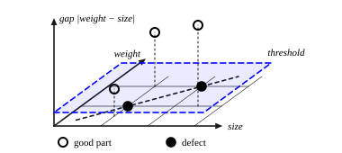

::: card
After attention, each position passes through a **feed-forward network**, the FFN. It goes up to
a wider space, bends there with ReLU, and comes back down:

$$ \mathrm{FFN}(\mathbf{x}) = \mathbf{W}_2\,\mathrm{ReLU}(\mathbf{W}_1\mathbf{x} + \mathbf{b}_1) + \mathbf{b}_2 $$

$\mathbf{W}_1 \in \mathbb{R}^{d_{ff} \times d}$ lifts $\mathbf{x} \in \mathbb{R}^d$ to $d_{ff}$
numbers, usually $d_{ff} = 4d$, and $\mathbf{W}_2 \in \mathbb{R}^{d \times d_{ff}}$ brings them back
to $d$ ([feed-forward network](reference:feed-forward-network)).
:::

::: card
Why go up? More dimensions give more room. A factory measures each part's size and weight. The
defective parts lie along the diagonal, where weight tracks size; the good parts sit on both
sides of it. In the plane of size and weight, no straight line separates them.
:::

::: card
Add a third feature, the gap $|\text{weight} - \text{size}|$. Defects have a small gap, good parts
a large one. In three dimensions the defects sit low and the good parts sit high, and one flat
plane splits them ([Figure](figure:lift-to-3d)). The data did not change. A new view of it made
the pattern linear.
:::

::: figure lift-to-3d

The same parts with a third coordinate, the gap between weight and size. The defects stay near
the floor; the good parts rise. A horizontal plane now separates them.
:::

::: card
Read the three moves. **Up**: each of the $d_{ff}$ rows of $\mathbf{W}_1$ asks one question of the
input, such as "is the weight above the size?". **Bend**: ReLU keeps the questions with a positive
answer and silences the rest. **Down**: $\mathbf{W}_2$ combines the surviving answers into a new
$d$-dimensional summary.
:::

::: card
A toy case with $d = 2$ and $d_{ff} = 3$. The third row asks "is size above weight?":

$$ \mathbf{W}_1 = \begin{bmatrix} 1 & 0 \\ 0 & 1 \\ 0.5 & -0.5 \end{bmatrix}, \qquad \mathbf{W}_2 = \begin{bmatrix} 1 & 0 & 0.5 \\ 0 & 1 & -0.5 \end{bmatrix}, \qquad \mathbf{b} = \mathbf{0} $$

For $\mathbf{x} = [3, 4]$, the hidden layer is $\mathrm{ReLU}([3, 4, -0.5]) = [3, 4, 0]$. The
third question says no, and the output is $[3, 4]$, the input unchanged.
:::

::: card
For $\mathbf{x} = [4, 2]$, the hidden layer is $\mathrm{ReLU}([4, 2, 1]) = [4, 2, 1]$. Now the third
question says yes, and the output is

$$ \mathbf{W}_2\,[4, 2, 1]^T = [4 + 0.5, \; 2 - 0.5] = [4.5, 1.5] $$

The output moved. The network wrote "size is above weight" into the new coordinates: the first
went up, the second down.
:::

::: exercise q1
In the toy FFN, what is the output for $\mathbf{x} = [6, 2]$?

::: answer
$[7, 1]$. The hidden layer is $[6, 2, 2]$, and $\mathbf{W}_2$ adds $\pm 1$.
:::
:::

::: exercise q2
$d = 512$ and $d_{ff} = 2048$. How many parameters does the FFN hold, biases included?

::: answer
2,099,712.
:::

::: solution
$\mathbf{W}_1$: $2048 \times 512 = 1{,}048{,}576$. $\mathbf{b}_1$: 2,048.

$\mathbf{W}_2$: $512 \times 2048 = 1{,}048{,}576$. $\mathbf{b}_2$: 512.

Total: $2{,}097{,}152 + 2{,}560 = 2{,}099{,}712$. ∎
:::
:::
