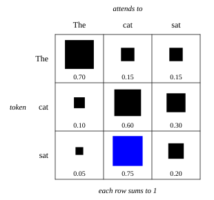

::: card
The attention matrix $\mathbf{A} \in \mathbb{R}^{n \times n}$ is where you can see what
self-attention does. Entry $a_{ij}$ is how much position $i$ attends to position $j$. Row $i$ is
the recipe for the new representation of token $i$
([Figure](figure:attention-matrix-cat-sat)).
:::

::: figure attention-matrix-cat-sat

The attention weights for "The cat sat". Each square's area is its weight. The row for "sat"
puts 0.75 on "cat".
:::

::: card
Read the row for "sat": 0.05 from "The", 0.75 from "cat", 0.20 from itself. The new
representation of "sat" is mostly the value of "cat". A verb is looking for its subject, and it
found it.
:::

::: card
Every row sums to 1 and every entry is positive, because each row is a softmax. Position $i$
shares out a fixed budget of attention across all positions, so you can read the weights as
probabilities.[Attention weights](reference:attention-weights)
:::

::: card
The matrix is not symmetric: in general $a_{ij} \neq a_{ji}$. "sat" puts 0.75 on "cat", but
"cat" puts only 0.30 on "sat". The verb searches for its subject; the noun has no reason to search
for its verb. A relationship in one direction says nothing about the other.
:::

::: card
The diagonal is often large. A token's own value is frequently useful for its output, so tokens
attend to themselves. The diagonal is learned, not built in: a model that finds self-attention
unhelpful learns to put little weight there.
:::

::: card
Trained models tend toward sparse rows: most weights are near zero and a few dominate. Each
position learns to focus on a small number of relevant positions rather than spreading its
attention evenly.
:::

::: card
The projections $\mathbf{W}^Q$, $\mathbf{W}^K$ and $\mathbf{W}^V$ decide what gets compared and
what gets carried, and training shapes them. Patterns that emerge:

- **syntax**: in "The cat ate the fish", the query of "ate" matches the keys of "cat" and "fish";
- **coreference**: in "John said he was tired", "he" attends strongly to "John".
:::

::: card
Distance costs nothing. In "The cat that I saw yesterday at the park was black", "was" attends
to "cat" directly. The path between any two positions is one attention step, however many words
sit between them.
:::

::: card
Attention can also copy. Put almost all the weight of a row on one source position and the output
of that row is almost exactly the source's value. This is how a model lifts an answer word for
word from its context.
:::

::: exercise missing-attention-weight
A row of an attention matrix reads $[0.10, 0.60, a]$. What is $a$?

::: answer
$0.30$. Each row of a softmax sums to 1.
:::

::: solution
$$ a = 1 - 0.10 - 0.60 = 0.30 $$

∎
:::
:::

::: exercise recurrent-path-length
In "The cat that I saw yesterday at the park was black", "cat" is word 2 and "was" is word 10.
How many recurrent steps separate them in an RNN, and how many attention steps in self-attention?

::: answer
8 recurrent steps and 1 attention step.
:::

::: solution
An RNN passes the state from word 2 to word 10 one word at a time.

$$ 10 - 2 = 8 $$

Self-attention connects any two positions directly: 1 step. ∎
:::
:::

::: exercise attention-symmetry
In an attention matrix, $a_{12} = 0.75$. What does this tell you about $a_{21}$?

::: answer
Nothing. The attention matrix is not symmetric in general.
:::
:::
