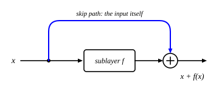

::: card
A **residual connection** adds a sublayer's input to its output:

$$ \mathbf{X}' = \mathbf{X} + f(\mathbf{X}) $$

where $f$ is self-attention or the FFN. In place of replacing $\mathbf{X}$, the sublayer adds a
correction to it ([Figure](figure:residual-block); [residual connection](reference:residual-connection)).
:::

::: figure residual-block

The input takes two paths: through the sublayer $f$, and around it. The two meet at the sum.
:::

::: card
Differentiate the sum:

$$ \frac{\partial \mathbf{X}'}{\partial \mathbf{X}} = \mathbf{I} + \frac{\partial f(\mathbf{X})}{\partial \mathbf{X}} $$

Even if the second term vanishes, the identity $\mathbf{I}$ remains. The gradient flows back along
the skip path with no multiplication at all. This direct path is the **gradient highway**, and it
lets networks of hundreds of layers train. It made deep vision networks (ResNet, 2015) and
transformers (2017) possible.
:::

::: card
Watch it on numbers. Three tokens, $d = 4$, and the output $\mathbf{O}$ of self-attention:

$$ \mathbf{X} = \begin{bmatrix} 1.0 & 0.5 & -0.5 & 0.2 \\ 0.8 & -0.3 & 0.6 & 0.1 \\ -0.2 & 0.7 & 0.3 & -0.4 \end{bmatrix}, \qquad \mathbf{O} = \begin{bmatrix} 0.2 & 0.1 & 0.3 & -0.1 \\ 0.1 & 0.2 & -0.2 & 0.1 \\ 0.3 & -0.1 & 0.1 & 0.2 \end{bmatrix} $$
:::

::: card
The residual output adds them, entry by entry:

$$ \mathbf{X}' = \mathbf{X} + \mathbf{O} = \begin{bmatrix} 1.2 & 0.6 & -0.2 & 0.1 \\ 0.9 & -0.1 & 0.4 & 0.2 \\ 0.1 & 0.6 & 0.4 & -0.2 \end{bmatrix} $$

The original values are all still there, nudged. Without the skip, $\mathbf{X}'$ would be
$\mathbf{O}$ alone, and anything attention missed would be lost.
:::

::: card
Three gains follow. The input is never lost: if the sublayer outputs zero, $\mathbf{X}' = \mathbf{X}$.
Learning a correction is easier than learning a whole new representation. And at the start of
training, when the sublayer outputs small noise, the network is close to the identity, a safe
place to begin.
:::

::: exercise q1
A sublayer outputs $[0.1, -0.3]$ for the input $[2, 1]$. What does the residual connection give?

::: answer
$[2.1, 0.7]$. Add the input and the output.
:::
:::

::: exercise q2
For a scalar sublayer, $\frac{\partial f}{\partial x} = 0.01$. What is $\frac{\partial x'}{\partial x}$
with the residual connection, and without it?

::: answer
1.01 with it, 0.01 without. The skip adds 1.
:::
:::

::: reference residual-connection
# Residual connection

A residual connection adds a sublayer's input to its output. Its Jacobian is the identity plus the
sublayer's own, so a gradient always passes along the skip.

::: equation
\mathbf{X}' = \mathbf{X} + f(\mathbf{X}) \qquad \frac{\partial \mathbf{X}'}{\partial \mathbf{X}} = \mathbf{I} + \frac{\partial f}{\partial \mathbf{X}}
:::

::: legend
$\mathbf{X}$: the input of the sublayer
$f$: the sublayer, self-attention or the FFN
$\mathbf{X}'$: the output, same shape as $\mathbf{X}$
$\mathbf{I}$: the identity
:::

::: derivation
The Jacobian of a sum is the sum of the Jacobians.[Jacobian](reference:jacobian)
The Jacobian of $\mathbf{X} \mapsto \mathbf{X}$ is $\mathbf{I}$.
A backward step multiplies by the transpose: $\nabla_{\mathbf{X}} L = \nabla_{\mathbf{X}'} L + \left(\frac{\partial f}{\partial \mathbf{X}}\right)^T \nabla_{\mathbf{X}'} L$.[backward step](reference:backward-jacobian-transpose)
The first term reaches $\mathbf{X}$ unchanged, whatever $f$ does. ∎
:::
:::
