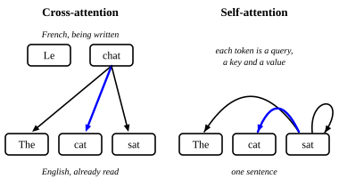

::: card
Attention compares a query against a set of keys and returns a blend of the matching values. It
says nothing about where the queries, keys and values come from. That choice splits attention
into two kinds.
:::

::: card
Take translation from English to French. An encoder reads "The cat sat" and keeps one hidden
state per word. A decoder writes the French one token at a time: "Le", then "chat". To write
"chat" it must look back at the English and find "cat".

The decoder's current state becomes the query. The encoder's states supply the keys and the
values. The query asks: which English words matter right now?
:::

::: card
This is **cross-attention**: the query comes from one sequence, the French being written, and the
keys and values come from another, the English already read
([Figure](figure:cross-and-self)).
:::

::: figure cross-and-self

Left: the French token "chat" queries the English tokens and finds "cat". Right: in one sentence,
"sat" queries every token of the same sentence, itself included.
:::

::: card
In **self-attention** one sequence supplies all three. Every token makes a query, a key and a
value, and every query is compared with every key of the same sequence, its own key included.
There is no second sequence.
:::

::: card
The payoff is reach. In one operation each position can gather what it needs from any other: a
verb finds its subject, a pronoun finds the noun it stands for, and a word picks up context from
anywhere in the sentence. Self-attention is the core operation of the transformer.
:::

::: exercise cross-or-self
A decoder state for the French token "chat" attends over the encoder states of "The cat sat".
Is this self-attention or cross-attention?

::: answer
Cross-attention. The query and the keys come from two different sequences.
:::
:::

::: exercise self-attention-pair-count
Self-attention runs over a sentence of 5 tokens. How many query and key pairs does it score?

::: answer
25. Each of the 5 queries meets all 5 keys, its own included.
:::

::: solution
Queries: 5. Keys per query: 5, the token's own key included.

$$ 5 \times 5 = 25 $$

∎
:::
:::
