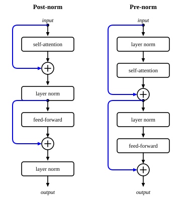

::: card
A transformer layer wraps both sublayers, attention and the FFN, in a residual connection and a
layer normalization. In the original design the norm comes after the sum, **post-norm**:

$$ \mathbf{X}_1 = \mathrm{LayerNorm}\big(\mathbf{X}_0 + \mathrm{SelfAttention}(\mathbf{X}_0)\big), \qquad \mathbf{X}_2 = \mathrm{LayerNorm}\big(\mathbf{X}_1 + \mathrm{FFN}(\mathbf{X}_1)\big) $$

The output $\mathbf{X}_2$ is the input of the next layer.
:::

::: card
GPT-2, GPT-3 and most recent models put the norm first, inside the branch, **pre-norm**:

$$ \mathbf{X}_1 = \mathbf{X}_0 + \mathrm{SelfAttention}\big(\mathrm{LayerNorm}(\mathbf{X}_0)\big), \qquad \mathbf{X}_2 = \mathbf{X}_1 + \mathrm{FFN}\big(\mathrm{LayerNorm}(\mathbf{X}_1)\big) $$

Now the skip path runs clean from the bottom of the stack to the top, with no norm on it. Very deep
networks, 50 layers and more, train more easily this way ([Figure](figure:layer-wiring)).
:::

::: figure layer-wiring

Left: post-norm, a norm after each sum. Right: pre-norm, a norm at the start of each branch, and
an unbroken skip path.
:::

::: card
Put every piece of this topic together, for one post-norm layer on $\mathbf{X} \in \mathbb{R}^{n \times d}$:

$$ \mathbf{A} = \mathrm{softmax}\left(\frac{\mathbf{Q}\mathbf{K}^T}{\sqrt{d_k}}\right), \quad \mathbf{X}^{(1)} = \mathrm{LayerNorm}(\mathbf{X} + \mathbf{A}\mathbf{V}), \quad \mathbf{X}^{(2)} = \mathrm{LayerNorm}\big(\mathbf{X}^{(1)} + \mathrm{FFN}(\mathbf{X}^{(1)})\big) $$

with $\mathbf{Q}, \mathbf{K}, \mathbf{V}$ projected from $\mathbf{X}$ and the FFN applied to each row.
:::

::: card
Stack $L$ such layers, from 6 to 96 in practice:
$\mathbf{X}^{(0)} \to \mathbf{X}^{(1)} \to \cdots \to \mathbf{X}^{(L)}$. Each piece has one job.
Attention moves information between positions. The FFN computes at each position. The residuals
keep the gradient flowing. The norms keep the scale steady.
:::

::: card
From text to prediction: tokens become embeddings, plus position information (the next topics);
$L$ layers transform them; and a final matrix $\mathbf{W}_{\text{vocab}} \in \mathbb{R}^{d \times V}$
turns each row of $\mathbf{X}^{(L)}$ into $V$ logits, one per word of the vocabulary. A softmax
makes them the probabilities of the next token.
:::

::: exercise q1
In pre-norm, which tensor is normalized before self-attention, and does the skip path pass
through a norm?

::: answer
$\mathbf{X}_0$ is normalized on its way into the attention branch. The skip path carries
$\mathbf{X}_0$ itself, with no norm.
:::
:::

::: exercise q2
A model has $d = 768$ and a vocabulary of $V = 50{,}257$. What is the shape of the logits for a
sequence of 10 tokens?

::: answer
$10 \times 50{,}257$. Each row of $\mathbf{X}^{(L)}$, of size 768, maps to $V$ logits.
:::
:::
