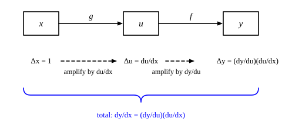

::: card
A neural network is many functions applied one after another. Start with two. The input $x$ goes
into $g$ and gives $u = g(x)$; then $u$ goes into $f$ and gives $y = f(u)$:

$$ x \xrightarrow{\;g\;} u \xrightarrow{\;f\;} y $$

You want $\frac{dy}{dx}$: how $y$ changes when you change $x$.
:::

::: card
The **chain rule** answers it. Multiply the derivative of each link:

$$ \frac{dy}{dx} = \frac{dy}{du} \cdot \frac{du}{dx} $$

[Chain rule](reference:chain-rule)
:::

::: card
Multiplication follows from small changes. A small change $\Delta x$ causes a change $\Delta u$,
and that change causes a change $\Delta y$. The first ratio is $u$'s change for each unit of $x$;
the second is $y$'s change for each unit of $u$. Chain them:

$$ \frac{\Delta y}{\Delta x} = \frac{\Delta y}{\Delta u} \cdot \frac{\Delta u}{\Delta x} $$

The $\Delta u$ cancels. Let every change shrink to zero and the ratios become derivatives.
:::

::: card
Read each link as an amplifier of small changes ([Figure](figure:chain-rule-amplification)). The
function $g$ multiplies a change in $x$ by $\frac{du}{dx}$. The function $f$ multiplies the change
in $u$ by $\frac{dy}{du}$. If $g$ doubles small changes and $f$ triples them, the composition
multiplies them by $2 \times 3 = 6$.
:::

::: figure chain-rule-amplification


A small change in $x$ is amplified by $\frac{du}{dx}$ into a change in $u$, then by
$\frac{dy}{du}$ into a change in $y$. The total amplification is the product.
:::

::: card
Take $y = (3x + 1)^2$. Name the inside $u = 3x + 1$, so $y = u^2$. Then $\frac{du}{dx} = 3$ and
$\frac{dy}{du} = 2u = 2(3x + 1)$. Multiply:

$$ \frac{dy}{dx} = 2(3x + 1) \cdot 3 = 6(3x + 1) $$
:::

::: card
Check it with numbers at $x = 2$, where $u = 7$ and $y = 49$. Step $\Delta x = 0.001$. Then
$u = 7.003$, so $\frac{\Delta u}{\Delta x} = 3$. Next $y = 7.003^2 = 49.042009$, so
$\Delta y = 0.042009$ and $\frac{\Delta y}{\Delta u} \approx 14.003 \approx 2u$. The total is
$\frac{\Delta y}{\Delta x} = 42.009$. The rule predicts $6 \cdot 7 = 42$, and the gap shrinks with
$\Delta x$.
:::

::: card
Plot the change $\Delta y$ against the step $\Delta x$, around the point $a$. Near zero the curve
hugs the dashed line of slope $6(3a + 1)$: the amplification the chain rule predicts. At $a = 2$
the slope is $42$. Far from zero the two part, because the rule speaks only of small changes.

```plot
x: { var: d, label: "the step $Δ x$", from: -0.5, to: 0.5, ticks: 0.1, grid: true }
y: { label: "the change $Δ y$", from: -25, to: 25 }

inputs:
  - { name: a, min: 0, max: 2, default: 2, step: 0.1, label: "the point a" }

draw:
  - curve: { is: 6 * (3 * a + 1) * d, dash: true, label: "slope $6(3a + 1)$" }
  - curve: { is: (3 * (a + d) + 1)^2 - (3 * a + 1)^2, accent: true, label: "actual $Δ y$" }
  - point: { at: [0, 0] }
```
:::

::: card
Longer chains work the same way. If $y = f(u)$, $u = g(v)$ and $v = h(x)$, then each link adds one
factor:

$$ \frac{dy}{dx} = \frac{dy}{du} \cdot \frac{du}{dv} \cdot \frac{dv}{dx} $$
:::

::: card
Take a small network: a hidden value $h = \sigma(z)$ with $z = wx + b$, and an output $y = vh$. To
train $w$ you need $\frac{dy}{dw}$. The chain runs $w \to z \to h \to y$:

$$ \frac{dy}{dw} = \frac{dy}{dh} \cdot \frac{dh}{dz} \cdot \frac{dz}{dw} = v \cdot \frac{d\sigma}{dz} \cdot x $$

Repeat this through every layer and you have backpropagation.
[Backpropagation](reference:backpropagation)
:::

::: exercise chain-rule-cubic
What is the derivative of $y = (2x + 5)^3$ at $x = -2$?

::: answer
$6$. The chain rule gives $3(2x + 5)^2 \cdot 2$.
:::

::: solution
$$ u = 2x + 5, \quad \frac{du}{dx} = 2, \quad \frac{dy}{du} = 3u^2 $$

At $x = -2$: $u = 1$.

$$ \frac{dy}{dx} = 3 \cdot 1^2 \cdot 2 = 6 $$

∎
:::
:::

::: exercise chain-rule-exponential
What is the derivative of $y = e^{3x}$ at $x = 0$?

::: answer
$3$. The outer derivative $e^{u}$ is $1$ at $u = 0$; the inner one is $3$.
:::

::: solution
$$ u = 3x, \quad \frac{dy}{dx} = e^{u} \cdot 3 = 3 e^{3x} $$

$$ 3 e^{0} = 3 $$

∎
:::
:::

::: exercise chain-rule-amplifiers
The function $g$ multiplies small changes by $4$ and the function $f$ multiplies small changes by
$0.5$. By what factor does $f(g(x))$ multiply a small change in $x$?

::: answer
$2$. The factors multiply: $4 \times 0.5$.
:::
:::

::: exercise chain-rule-three-links
Write $y = (x^2 + 1)^3$ as the chain $v = x^2$, $u = v + 1$, $y = u^3$. What is $\frac{dy}{dx}$
at $x = 1$?

::: answer
$24$. Multiply the three factors $3u^2$, $1$ and $2x$.
:::

::: solution
$$ \frac{dy}{dx} = \frac{dy}{du} \cdot \frac{du}{dv} \cdot \frac{dv}{dx} = 3u^2 \cdot 1 \cdot 2x $$

At $x = 1$: $v = 1$, $u = 2$.

$$ \frac{dy}{dx} = 3 \cdot 4 \cdot 1 \cdot 2 = 24 $$

∎
:::
:::

::: reference chain-rule
# Chain rule

The derivative of a composition is the product of the derivatives of its links, each taken at the
point the chain passes through.

::: equation
\frac{dy}{dx} = \frac{dy}{du} \cdot \frac{du}{dx} \qquad y = f(u), \; u = g(x)
:::

::: legend
$x$: the input
$u$: the intermediate value, the output of g
$y$: the output, the output of f
:::

::: derivation
Near $x$, $g$ is close to its tangent line: $\Delta u = \frac{du}{dx} \Delta x + \epsilon_1 \Delta x$, with $\epsilon_1 \to 0$ as $\Delta x \to 0$.[Derivative](reference:derivative)
Near $u$, $f$ is close to its tangent line: $\Delta y = \frac{dy}{du} \Delta u + \epsilon_2 \Delta u$, with $\epsilon_2 \to 0$ as $\Delta u \to 0$, and $\epsilon_2 = 0$ when $\Delta u = 0$.
Substitute the first into the second: $\Delta y = \left(\frac{dy}{du} + \epsilon_2\right)\left(\frac{du}{dx} + \epsilon_1\right) \Delta x$.
Divide by $\Delta x$: $\frac{\Delta y}{\Delta x} = \left(\frac{dy}{du} + \epsilon_2\right)\left(\frac{du}{dx} + \epsilon_1\right)$.
As $\Delta x \to 0$, $\Delta u \to 0$, so both $\epsilon_1$ and $\epsilon_2$ go to zero: $\frac{dy}{dx} = \frac{dy}{du} \cdot \frac{du}{dx}$. ∎
:::
:::
