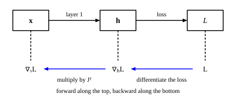

::: card
A network is a chain of vector functions, ending in a scalar loss:

$$ \mathbf{x} \xrightarrow{\text{layer 1}} \mathbf{h}_1 \xrightarrow{\text{layer 2}} \mathbf{h}_2 \xrightarrow{\;\cdots\;} \mathbf{h}_L \xrightarrow{\text{loss}} L $$

You want $\nabla_\mathbf{x} L$, how the loss depends on the input, and in the same way on the
parameters of every layer.
:::

::: card
Start at the loss and walk back. You know $\nabla_{\mathbf{h}_L} L$, the gradient at the last
layer. Each step back multiplies by the transpose of one layer's Jacobian:

$$ \nabla_{\mathbf{h}_{L-1}} L = \mathbf{J}_L^T \, \nabla_{\mathbf{h}_L} L, \qquad \nabla_{\mathbf{h}_{L-2}} L = \mathbf{J}_{L-1}^T \, \nabla_{\mathbf{h}_{L-1}} L, \qquad \ldots $$

Here $\mathbf{J}_L$ is the Jacobian of layer $L$, the map from $\mathbf{h}_{L-1}$ to
$\mathbf{h}_L$ ([Figure](figure:backward-pass)).
[Backward step](reference:backward-jacobian-transpose)
:::

::: figure backward-pass

The values flow forward through the layers to the loss. The gradient flows back, multiplied at
each layer by the transpose of its Jacobian.
:::

::: card
Trace a tiny network with two inputs, two hidden values and a loss:

$$ h_1 = x_1 + x_2, \qquad h_2 = x_1 - x_2, \qquad L = h_1^2 + h_2^2 $$

At $\mathbf{x} = [3, 1]^T$ the hidden values are $\mathbf{h} = [4, 2]^T$ and the loss is
$L = 16 + 4 = 20$.
:::

::: card
First, the gradient at the output. Differentiate the loss by each hidden value:

$$ \nabla_\mathbf{h} L = \begin{bmatrix} \frac{\partial L}{\partial h_1} \\ \frac{\partial L}{\partial h_2} \end{bmatrix} = \begin{bmatrix} 2h_1 \\ 2h_2 \end{bmatrix} = \begin{bmatrix} 8 \\ 4 \end{bmatrix} $$
:::

::: card
Second, the Jacobian of layer 1, how $\mathbf{h}$ depends on $\mathbf{x}$:

$$ \mathbf{J} = \begin{bmatrix} \frac{\partial h_1}{\partial x_1} & \frac{\partial h_1}{\partial x_2} \\ \frac{\partial h_2}{\partial x_1} & \frac{\partial h_2}{\partial x_2} \end{bmatrix} = \begin{bmatrix} 1 & 1 \\ 1 & -1 \end{bmatrix} $$
:::

::: card
Third, step back through the layer. Multiply by $\mathbf{J}^T$:

$$ \nabla_\mathbf{x} L = \mathbf{J}^T \nabla_\mathbf{h} L = \begin{bmatrix} 1 & 1 \\ 1 & -1 \end{bmatrix} \begin{bmatrix} 8 \\ 4 \end{bmatrix} = \begin{bmatrix} 8 + 4 \\ 8 - 4 \end{bmatrix} = \begin{bmatrix} 12 \\ 4 \end{bmatrix} $$

This $\mathbf{J}$ is symmetric, so $\mathbf{J}^T$ looks the same.
:::

::: card
Check by substitution. $L = (x_1 + x_2)^2 + (x_1 - x_2)^2 = 2x_1^2 + 2x_2^2$, so

$$ \nabla_\mathbf{x} L = \begin{bmatrix} 4x_1 \\ 4x_2 \end{bmatrix} = \begin{bmatrix} 12 \\ 4 \end{bmatrix} $$

The backward pass gave the same answer without ever writing $L$ in terms of $\mathbf{x}$.
:::

::: card
The transpose comes from the paths. The first entry is $1 \cdot 8 + 1 \cdot 4 = 12$, which is

$$ \frac{\partial L}{\partial x_1} = \frac{\partial L}{\partial h_1}\frac{\partial h_1}{\partial x_1} + \frac{\partial L}{\partial h_2}\frac{\partial h_2}{\partial x_1} $$

a sum over the intermediate values $h_1, h_2$. It is the dot product of $\nabla_\mathbf{h} L$ with
column 1 of $\mathbf{J}$. Column 1 of $\mathbf{J}$ is row 1 of $\mathbf{J}^T$.
:::

::: card
So the backward pass does two things. It multiplies Jacobians across layers, because effects
compound along the chain. Inside each Jacobian product it sums, because each input reaches the
loss through many intermediate values, and every path counts. This is how a network learns.
:::

::: exercise backward-step-numbers
At a layer with Jacobian $\mathbf{J} = \begin{bmatrix} 2 & 0 \\ 1 & 3 \end{bmatrix}$, the
gradient at its output is $\nabla_\mathbf{h} L = [1, 2]^T$. What is the gradient at its input?

::: answer
$[4, 6]^T$. Multiply by $\mathbf{J}^T$, not $\mathbf{J}$.
:::

::: solution
$$ \mathbf{J}^T = \begin{bmatrix} 2 & 1 \\ 0 & 3 \end{bmatrix} $$

$$ \mathbf{J}^T \nabla_\mathbf{h} L = \begin{bmatrix} 2 \cdot 1 + 1 \cdot 2 \\ 0 \cdot 1 + 3 \cdot 2 \end{bmatrix} = \begin{bmatrix} 4 \\ 6 \end{bmatrix} $$

∎
:::
:::

::: exercise backward-full-network
Let $h_1 = 2x_1$, $h_2 = x_1 + x_2$ and $L = h_1 h_2$. Use the backward pass to find
$\nabla_\mathbf{x} L$ at $\mathbf{x} = [1, 1]^T$.

::: answer
$[6, 2]^T$. Here $\nabla_\mathbf{h} L = [h_2, h_1]^T = [2, 2]^T$.
:::

::: solution
At $\mathbf{x} = [1, 1]^T$: $\mathbf{h} = [2, 2]^T$.

$$ \nabla_\mathbf{h} L = \begin{bmatrix} h_2 \\ h_1 \end{bmatrix} = \begin{bmatrix} 2 \\ 2 \end{bmatrix}, \qquad \mathbf{J} = \begin{bmatrix} 2 & 0 \\ 1 & 1 \end{bmatrix} $$

$$ \nabla_\mathbf{x} L = \mathbf{J}^T \nabla_\mathbf{h} L = \begin{bmatrix} 2 & 1 \\ 0 & 1 \end{bmatrix} \begin{bmatrix} 2 \\ 2 \end{bmatrix} = \begin{bmatrix} 6 \\ 2 \end{bmatrix} $$

Check: $L = 2x_1^2 + 2x_1 x_2$, so $\frac{\partial L}{\partial x_1} = 4x_1 + 2x_2 = 6$ and
$\frac{\partial L}{\partial x_2} = 2x_1 = 2$. ∎
:::
:::

::: exercise backward-shapes
A layer maps $\mathbb{R}^3$ to $\mathbb{R}^5$. How many entries does the gradient at its input
have, and what shape is the matrix that produces it?

::: answer
Three entries, from the $3 \times 5$ matrix $\mathbf{J}^T$. The Jacobian itself is $5 \times 3$.
:::
:::

::: reference backward-jacobian-transpose
# Backward step through a layer

The gradient of a scalar loss with respect to a layer's input is the transpose of the layer's
Jacobian times the gradient with respect to its output.

::: equation
\nabla_\mathbf{x} L = \mathbf{J}^T \, \nabla_\mathbf{h} L \qquad J_{ki} = \frac{\partial h_k}{\partial x_i}
:::

::: legend
$\mathbf{x}$: the layer's input, n entries
$\mathbf{h}$: the layer's output, m entries
$\mathbf{J}$: the Jacobian of the layer, m rows by n columns
$L$: a scalar loss that depends on x only through h
:::

::: derivation
The input $x_i$ reaches $L$ through every $h_k$: $\frac{\partial L}{\partial x_i} = \sum_{k=1}^{m} \frac{\partial L}{\partial h_k} \frac{\partial h_k}{\partial x_i}$.[Multivariable chain rule](reference:multivariable-chain-rule)
The factor $\frac{\partial h_k}{\partial x_i}$ is $J_{ki}$, the entry of column $i$.[Jacobian](reference:jacobian)
So $\frac{\partial L}{\partial x_i} = \sum_k (J^T)_{ik} \frac{\partial L}{\partial h_k}$, row $i$ of $\mathbf{J}^T$ times $\nabla_\mathbf{h} L$.[Matrix-vector product](reference:matrix-vector-product)
Stack the $n$ entries: $\nabla_\mathbf{x} L = \mathbf{J}^T \nabla_\mathbf{h} L$. ∎
:::
:::
