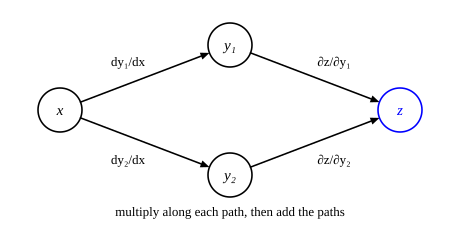

::: card
A network passes its input through layer 1, then layer 2, then layer 3, and on to the loss. The
loss depends on the output, the output on the layers before it, and those on the parameters. A
small change to a weight $w$ in layer 1 travels forward through every later layer. To train $w$
you must track that chain of influence.
:::

::: card
With a single path, $x \to y \to z$, you already know the rule. Multiply the rates of change
along the path:

$$ \frac{dz}{dx} = \frac{dz}{dy} \cdot \frac{dy}{dx} $$
:::

::: card
Often $x$ reaches $z$ through more than one intermediate variable. Here $x$ affects both $y_1$
and $y_2$, and both affect $z$ ([Figure](figure:two-paths)).
:::

::: figure two-paths


The input $x$ reaches $z$ through $y_1$ and through $y_2$. Each arrow carries the rate of change
of its link.
:::

::: card
A small change $\Delta x$ moves both intermediates:

$$ \Delta y_1 \approx \frac{dy_1}{dx} \Delta x, \qquad \Delta y_2 \approx \frac{dy_2}{dx} \Delta x $$

Each of these moves $z$ in its turn: by $\frac{\partial z}{\partial y_1} \Delta y_1$ through the
first path, and by $\frac{\partial z}{\partial y_2} \Delta y_2$ through the second.
:::

::: card
The total change in $z$ is the sum of the two effects. Divide by $\Delta x$:

$$ \frac{dz}{dx} = \frac{\partial z}{\partial y_1}\frac{dy_1}{dx} + \frac{\partial z}{\partial y_2}\frac{dy_2}{dx} $$

The general rule: multiply along each path, then add over all paths.
[Multivariable chain rule](reference:multivariable-chain-rule)
:::

::: card
You add because the effects through different paths are independent. A small change in $x$
nudges both $y_1$ and $y_2$, and $z$ feels both nudges. To first order, the two do not interact.
You multiply along a path because each link amplifies or shrinks the change: if $y$ grows by 2
for each unit of $x$, and $z$ by 3 for each unit of $y$, then $z$ grows by $2 \times 3 = 6$.
:::

::: card
Try $z = y_1 y_2$ with $y_1 = x^2$ and $y_2 = 3x$. The path through $y_1$ gives
$y_2 \cdot 2x = 6x^2$; the path through $y_2$ gives $y_1 \cdot 3 = 3x^2$. Their sum is $9x^2$,
which matches $z = 3x^3$ differentiated directly. At $x = 1$ the paths give 6 and 3, total 9.

```plot
x: { var: x, label: "$x$", from: 0, to: 2, ticks: 0.25, grid: true }
y: { label: "rate of change", from: 0, to: 36 }

inputs:
  - { name: a, min: 0, max: 2, default: 1, step: 0.05, label: "the point a" }

draw:
  - curve: { is: 6 * x^2, dash: true, label: "through $y₁$" }
  - curve: { is: 3 * x^2, dash: true, label: "through $y₂$" }
  - curve: { is: 9 * x^2, accent: true, label: "$dz/dx$" }
  - point: { at: [a, 6 * a^2] }
  - point: { at: [a, 3 * a^2] }
  - point: { at: [a, 9 * a^2], label: "the sum" }
```
:::

::: exercise two-paths-sum
Let $z = y_1 + y_2$ with $y_1 = x^2$ and $y_2 = e^x$. What is $\frac{dz}{dx}$ at $x = 0$?

::: answer
$1$. The paths give $1 \cdot 2x = 0$ and $1 \cdot e^x = 1$.
:::

::: solution
$$ \frac{dz}{dx} = \frac{\partial z}{\partial y_1}\frac{dy_1}{dx} + \frac{\partial z}{\partial y_2}\frac{dy_2}{dx} = 1 \cdot 2x + 1 \cdot e^x $$

$$ 1 \cdot 0 + 1 \cdot 1 = 1 $$

∎
:::
:::

::: exercise two-paths-product
Let $z = y_1 y_2$ with $y_1 = x + 1$ and $y_2 = x - 1$. What is $\frac{dz}{dx}$ at $x = 2$?

::: answer
$4$. The paths give $y_2 \cdot 1 = 1$ and $y_1 \cdot 1 = 3$.
:::

::: solution
At $x = 2$: $y_1 = 3$, $y_2 = 1$.

$$ \frac{dz}{dx} = y_2 \cdot 1 + y_1 \cdot 1 = 1 + 3 = 4 $$

Check: $z = x^2 - 1$, so $\frac{dz}{dx} = 2x = 4$. ∎
:::
:::

::: exercise two-paths-numbers
At some point, $\frac{\partial z}{\partial y_1} = 2$, $\frac{\partial z}{\partial y_2} = -1$,
$\frac{dy_1}{dx} = 3$ and $\frac{dy_2}{dx} = 4$. What is $\frac{dz}{dx}$?

::: answer
$2$. Multiply along each path, then add: $6 - 4$.
:::
:::

::: reference multivariable-chain-rule
# Multivariable chain rule

When $x$ reaches $z$ through several intermediate variables $y_1, \ldots, y_m$, the derivative is
the sum over the paths of the product along each path.

::: equation
\frac{dz}{dx} = \sum_{k=1}^{m} \frac{\partial z}{\partial y_k} \frac{dy_k}{dx}
:::

::: legend
$x$: the input
$y_k$: the k-th intermediate variable, a function of x
$z$: the output, a function of all the intermediates
$m$: the number of intermediates
:::

::: derivation
A small change $\Delta x$ moves each intermediate by $\Delta y_k \approx \frac{dy_k}{dx} \Delta x$.[Derivative](reference:derivative)
To first order, $z$ responds to each intermediate along its own slope, and the responses add: $\Delta z \approx \sum_k \frac{\partial z}{\partial y_k} \Delta y_k$.[Partial derivative](reference:partial-derivative)
Substitute: $\Delta z \approx \sum_k \frac{\partial z}{\partial y_k} \frac{dy_k}{dx} \Delta x$.
Divide by $\Delta x$ and let $\Delta x \to 0$. With a single intermediate this is the one variable rule.[Chain rule](reference:chain-rule) ∎
:::
:::
