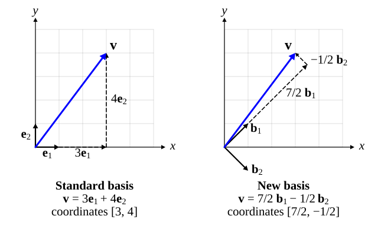

::: card
A set of vectors is **linearly independent** when none of them is redundant: no vector of the set
is a linear combination of the others. In $\mathbb{R}^2$, $\mathbf{v}_1 = \begin{bmatrix} 1 \\ 0 \end{bmatrix}$
and $\mathbf{v}_2 = \begin{bmatrix} 0 \\ 1 \end{bmatrix}$ are independent: no scaling of one
gives the other. Add $\mathbf{v}_3 = \begin{bmatrix} 2 \\ 3 \end{bmatrix}$ and the set becomes
dependent, because $\mathbf{v}_3 = 2\mathbf{v}_1 + 3\mathbf{v}_2$.
:::

::: card
The precise test: the vectors are independent when the only way to build the zero vector from
them is with all weights zero.

$$ c_1\mathbf{v}_1 + c_2\mathbf{v}_2 + \cdots + c_k\mathbf{v}_k = \mathbf{0} \implies c_1 = c_2 = \cdots = c_k = 0 $$
:::

::: card
The test catches every redundant vector. Suppose $\mathbf{v}_1 = a_2\mathbf{v}_2 + \cdots + a_k\mathbf{v}_k$.
Move everything to one side:

$$ \mathbf{v}_1 - a_2\mathbf{v}_2 - \cdots - a_k\mathbf{v}_k = \mathbf{0} $$

This builds zero with the weight 1 on $\mathbf{v}_1$, which is not zero. So a redundant vector
always gives a nonzero way to reach zero, and the test fails
([linear independence](reference:linear-independence)).
:::

::: card
A **basis** of a vector space is a linearly independent set that reaches every vector of the space
by linear combinations. The number of vectors in a basis is the **dimension** of the space. The
**standard basis** of $\mathbb{R}^n$ holds one 1 in each position:

$$ \mathbf{e}_1 = \begin{bmatrix} 1 \\ 0 \\ \vdots \\ 0 \end{bmatrix}, \quad \mathbf{e}_2 = \begin{bmatrix} 0 \\ 1 \\ \vdots \\ 0 \end{bmatrix}, \quad \ldots, \quad \mathbf{e}_n = \begin{bmatrix} 0 \\ 0 \\ \vdots \\ 1 \end{bmatrix} $$
:::

::: card
Every $\mathbf{v} \in \mathbb{R}^n$ is written in exactly one way as
$\mathbf{v} = v_1\mathbf{e}_1 + v_2\mathbf{e}_2 + \cdots + v_n\mathbf{e}_n$. The standard basis
is one choice among infinitely many: any $n$ independent vectors of $\mathbb{R}^n$ form a basis.
In $\mathbb{R}^2$, $\mathbf{b}_1 = \begin{bmatrix} 1 \\ 1 \end{bmatrix}$ and
$\mathbf{b}_2 = \begin{bmatrix} 1 \\ -1 \end{bmatrix}$ form a perfectly good one.
:::

::: card
The same vector has different coordinates in different bases. Take
$\mathbf{v} = \begin{bmatrix} 3 \\ 4 \end{bmatrix}$. In the standard basis the numbers mean
$\mathbf{v} = 3\mathbf{e}_1 + 4\mathbf{e}_2$. Its coordinates in the basis
$\mathbf{b}_1, \mathbf{b}_2$ are the weights $c_1, c_2$ with

$$ c_1\begin{bmatrix} 1 \\ 1 \end{bmatrix} + c_2\begin{bmatrix} 1 \\ -1 \end{bmatrix} = \begin{bmatrix} 3 \\ 4 \end{bmatrix} $$
:::

::: card
Read the equation one row at a time: $c_1 + c_2 = 3$ and $c_1 - c_2 = 4$. Add the two
equations: $2c_1 = 7$, so $c_1 = 7/2$. Subtract them: $2c_2 = -1$, so $c_2 = -1/2$. Check:

$$ \frac{7}{2}\begin{bmatrix} 1 \\ 1 \end{bmatrix} - \frac{1}{2}\begin{bmatrix} 1 \\ -1 \end{bmatrix} = \begin{bmatrix} 7/2 - 1/2 \\ 7/2 + 1/2 \end{bmatrix} = \begin{bmatrix} 3 \\ 4 \end{bmatrix} $$
:::

::: figure basis-change


The same vector $\mathbf{v}$ in two bases. Left: $\mathbf{v} = 3\mathbf{e}_1 + 4\mathbf{e}_2$,
coordinates $[3, 4]$. Right: $\mathbf{v} = \frac{7}{2}\mathbf{b}_1 - \frac{1}{2}\mathbf{b}_2$,
coordinates $[7/2, -1/2]$. The arrow ends at the same point in both.
:::

::: card
In [Figure](figure:basis-change) the vector $\mathbf{v}$ ends at the same point in both pictures.
On the left you get there with 3 steps along $\mathbf{e}_1$ and 4 along $\mathbf{e}_2$. On the
right you take $7/2$ steps along $\mathbf{b}_1$ and $-1/2$ along $\mathbf{b}_2$. The pair
$[7/2, -1/2]$ does not mean the point $x = 3.5$, $y = -0.5$. It means a recipe in the new basis,
and the recipe lands on the same spot.
:::

::: card
Try the recipe yourself. Move the two weights until the blue tip lands on $\mathbf{v}$. It does
so only at $c_1 = 3.5$ and $c_2 = -0.5$: in a basis, the coordinates are unique
([coordinates in a basis](reference:basis-coordinates)).

```plot
x: { var: t, label: "$x₁$", from: -2, to: 8, ticks: 1, grid: true }
y: { label: "$x₂$", from: -1, to: 5 }

inputs:
  - { name: c1, min: -1, max: 5, default: 2, step: 0.5, label: "weight on b1" }
  - { name: c2, min: -2, max: 2, default: 1, step: 0.5, label: "weight on b2" }

draw:
  - param: { var: s, over: [0, 1], x: s, y: s, label: "b1" }
  - param: { var: s, over: [0, 1], x: s, y: -s, label: "b2" }
  - param: { var: s, over: [0, 1], x: s * c1, y: s * c1, dash: true }
  - param: { var: s, over: [0, 1], x: c1 + s * c2, y: c1 - s * c2, dash: true }
  - param: { var: s, over: [0, 1], x: s * (c1 + c2), y: s * (c1 - c2), accent: true }
  - point: { at: [3, 4], label: "v" }
```
:::

::: card
A good basis makes a pattern plain. Points in a tilted ellipse look tangled along $x$ and $y$,
and simple along the ellipse's own axes. Attention works the same way: its query, key and value
matrices project word vectors into new bases, learned from data, in which words that should
interact line up.
:::

::: exercise q1
Are $\begin{bmatrix} 1 \\ 0 \\ 1 \end{bmatrix}$, $\begin{bmatrix} 0 \\ 1 \\ 1 \end{bmatrix}$ and
$\begin{bmatrix} 1 \\ 1 \\ 2 \end{bmatrix}$ linearly independent?

::: answer
No. The third vector is the sum of the first two.
:::

::: solution
$$ \begin{bmatrix} 1 \\ 0 \\ 1 \end{bmatrix} + \begin{bmatrix} 0 \\ 1 \\ 1 \end{bmatrix} = \begin{bmatrix} 1 \\ 1 \\ 2 \end{bmatrix} $$

So $1 \cdot \mathbf{v}_1 + 1 \cdot \mathbf{v}_2 - 1 \cdot \mathbf{v}_3 = \mathbf{0}$ with nonzero
weights. The set is dependent. ∎
:::
:::

::: exercise q2
Find the coordinates of $\begin{bmatrix} 5 \\ 1 \end{bmatrix}$ in the basis
$\mathbf{b}_1 = \begin{bmatrix} 1 \\ 1 \end{bmatrix}$, $\mathbf{b}_2 = \begin{bmatrix} 1 \\ -1 \end{bmatrix}$.

::: answer
$[3, 2]$. Solve $c_1 + c_2 = 5$ and $c_1 - c_2 = 1$.
:::

::: solution
Add the equations: $2c_1 = 6$, so $c_1 = 3$.

Subtract them: $2c_2 = 4$, so $c_2 = 2$.

Check: $3\begin{bmatrix} 1 \\ 1 \end{bmatrix} + 2\begin{bmatrix} 1 \\ -1 \end{bmatrix} = \begin{bmatrix} 5 \\ 1 \end{bmatrix}$. ∎
:::
:::

::: exercise q3
A basis of a vector space holds 6 vectors. What is the dimension of the space, and can 7 vectors
of it be linearly independent?

::: answer
The dimension is 6, and 7 vectors cannot be independent. Every basis of a space has as many
vectors as its dimension, and no independent set has more.
:::
:::

::: reference linear-independence
# Linear independence

Vectors $\mathbf{v}_1, \ldots, \mathbf{v}_k$ are linearly independent when the only linear
combination of them that equals the zero vector has all weights zero. Equivalently, none of them
is a linear combination of the others.

::: equation
c_1\mathbf{v}_1 + \cdots + c_k\mathbf{v}_k = \mathbf{0} \implies c_1 = \cdots = c_k = 0
:::

::: legend
$\mathbf{v}_i$: the vectors tested
$c_i$: scalar weights
$\mathbf{0}$: the zero vector
:::

::: derivation
Suppose one vector is redundant: $\mathbf{v}_1 = a_2\mathbf{v}_2 + \cdots + a_k\mathbf{v}_k$.
Then $\mathbf{v}_1 - a_2\mathbf{v}_2 - \cdots - a_k\mathbf{v}_k = \mathbf{0}$, with weight $1 \neq 0$ on $\mathbf{v}_1$.
So a redundant vector breaks the test.
Conversely, suppose $c_1\mathbf{v}_1 + \cdots + c_k\mathbf{v}_k = \mathbf{0}$ with some $c_j \neq 0$.
Divide by $c_j$: $\mathbf{v}_j = -\sum_{i \neq j} (c_i / c_j)\,\mathbf{v}_i$, so $\mathbf{v}_j$ is redundant. ∎
:::
:::

::: reference basis-coordinates
# Coordinates in a basis

Given a basis $\mathbf{b}_1, \ldots, \mathbf{b}_n$ of a space, every vector of the space is one
linear combination of the basis vectors, and its weights are unique. Those weights are the
vector's coordinates in that basis.

::: equation
\mathbf{v} = c_1\mathbf{b}_1 + c_2\mathbf{b}_2 + \cdots + c_n\mathbf{b}_n
:::

::: legend
$\mathbf{v}$: any vector of the space
$\mathbf{b}_i$: the basis vectors
$c_i$: the coordinates of $\mathbf{v}$ in this basis
$n$: the dimension of the space
:::

::: derivation
A basis reaches every vector, so at least one set of weights exists.
Suppose two sets exist: $\sum_i c_i\mathbf{b}_i = \mathbf{v} = \sum_i d_i\mathbf{b}_i$.
Subtract: $\sum_i (c_i - d_i)\mathbf{b}_i = \mathbf{0}$.
The basis vectors are independent, so every $c_i - d_i = 0$.[linear independence](reference:linear-independence)
So $c_i = d_i$ for every $i$. ∎
:::
:::
