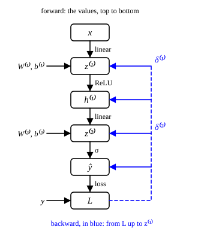

::: card
Training lowers the loss $\mathcal{L}(\boldsymbol{\theta})$ by moving the parameters, and for that
it needs the gradient $\nabla_{\boldsymbol{\theta}} \mathcal{L}$: how the loss changes with each
parameter. A network has millions of them. **Backpropagation** computes all of these partial
derivatives in one backward sweep, at about the cost of one forward pass.
:::

::: card
Read the network as a **computation graph**. Each node is a value; each arrow is one operation.
For the two-layer network:

$$ \mathbf{x} \to \mathbf{z}^{(1)} \to \mathbf{h}^{(1)} \to z^{(2)} \to \hat{y} \to \mathcal{L} $$

A change in $\mathbf{W}^{(1)}$ reaches the loss only by flowing along these arrows
([Figure](figure:computation-graph)).
:::

::: figure computation-graph

The forward pass computes the values from top to bottom. The backward pass, in blue, sends the
error signals $\boldsymbol{\delta}$ from the loss back up to every layer.
:::

::: card
The work has two passes. The **forward pass** computes every value, from the input to the loss,
and keeps them. The **backward pass** walks from the loss back to the input and asks at each
node: how much does the loss change if this value changes? At the pre-activation of a layer the
answer has a name, the **error signal**:

$$ \boldsymbol{\delta}^{(\ell)} = \frac{\partial \mathcal{L}}{\partial \mathbf{z}^{(\ell)}} $$
:::

::: card
Take one example with a sigmoid output and the loss $\mathcal{L} = \frac{1}{2}(y - \hat{y})^2$.
The output error multiplies two links of the chain:

$$ \delta^{(2)} = \frac{\partial \mathcal{L}}{\partial \hat{y}} \cdot \frac{\partial \hat{y}}{\partial z^{(2)}} = (\hat{y} - y) \cdot \hat{y}(1 - \hat{y}) $$

The first factor is the derivative of the loss, the second is the [sigmoid](reference:sigmoid)'s
own slope.
:::

::: card
The parameters of a layer get their gradients straight from its error signal. Since
$z^{(2)} = \mathbf{W}^{(2)}\mathbf{h}^{(1)} + b^{(2)}$:

$$ \frac{\partial \mathcal{L}}{\partial \mathbf{W}^{(2)}} = \delta^{(2)} \left(\mathbf{h}^{(1)}\right)^T, \qquad \frac{\partial \mathcal{L}}{\partial b^{(2)}} = \delta^{(2)} $$

A weight's gradient is the error at its output times the value at its input.
:::

::: card
To go one layer back, send the error through the weights, then through the activation:

$$ \frac{\partial \mathcal{L}}{\partial \mathbf{h}^{(1)}} = \left(\mathbf{W}^{(2)}\right)^T \delta^{(2)}, \qquad \boldsymbol{\delta}^{(1)} = \frac{\partial \mathcal{L}}{\partial \mathbf{h}^{(1)}} \odot \frac{d\sigma}{dz}\left(\mathbf{z}^{(1)}\right) $$

The weights that carried the signal forward distribute the error backward. The symbol $\odot$
multiplies entry by entry. For ReLU the slope is 1 where $z_j^{(1)} > 0$ and 0 elsewhere.
:::

::: card
Then the first layer's gradients follow the same pattern as the second's:

$$ \frac{\partial \mathcal{L}}{\partial \mathbf{W}^{(1)}} = \boldsymbol{\delta}^{(1)} \mathbf{x}^T, \qquad \frac{\partial \mathcal{L}}{\partial \mathbf{b}^{(1)}} = \boldsymbol{\delta}^{(1)} $$

Any depth works the same way: one error signal per layer, each made from the one after it
([backpropagation](reference:backpropagation)).
:::

::: exercise q1
A layer has $\boldsymbol{\delta} = [0.2, -0.1]^T$ and its input is $\mathbf{h} = [1, 3]^T$. What is
the gradient of the loss with respect to its weight matrix?

::: answer
$\begin{bmatrix} 0.2 & 0.6 \\ -0.1 & -0.3 \end{bmatrix}$. It is the outer product
$\boldsymbol{\delta}\mathbf{h}^T$.
:::
:::

::: exercise q2
A ReLU layer has $\mathbf{z} = [1.5, -0.3, 0.7]^T$, and the gradient arriving at its output is
$[0.4, 0.9, -0.2]^T$. What is $\boldsymbol{\delta}$?

::: answer
$[0.4, 0, -0.2]^T$. The ReLU mask is $[1, 0, 1]^T$.
:::
:::

::: exercise q3
Why does backpropagation keep the values of the forward pass?

::: answer
The backward pass needs them: each gradient uses the layer's input, such as
$\mathbf{h}^{(1)}$ in $\delta^{(2)}(\mathbf{h}^{(1)})^T$, and each activation slope uses its
$\mathbf{z}$.
:::
:::

::: reference backpropagation
# Backpropagation

The error signal of a layer is the next layer's error signal sent back through the next layer's
weights, times the slope of the activation. Each weight gradient is the error signal times the
layer's input.

::: equation
\boldsymbol{\delta}^{(\ell)} = \left(\left(\mathbf{W}^{(\ell+1)}\right)^T \boldsymbol{\delta}^{(\ell+1)}\right) \odot \frac{d\sigma}{dz}\left(\mathbf{z}^{(\ell)}\right) \qquad \frac{\partial \mathcal{L}}{\partial \mathbf{W}^{(\ell)}} = \boldsymbol{\delta}^{(\ell)} \left(\mathbf{h}^{(\ell-1)}\right)^T \qquad \frac{\partial \mathcal{L}}{\partial \mathbf{b}^{(\ell)}} = \boldsymbol{\delta}^{(\ell)}
:::

::: legend
$\boldsymbol{\delta}^{(\ell)}$: the error signal, $\partial \mathcal{L} / \partial \mathbf{z}^{(\ell)}$
$\mathbf{z}^{(\ell)}$: the pre-activation of layer $\ell$
$\mathbf{h}^{(\ell)}$: the output of layer $\ell$, with $\mathbf{h}^{(0)} = \mathbf{x}$
$\mathbf{W}^{(\ell)}, \mathbf{b}^{(\ell)}$: the weights and the bias of layer $\ell$
$\odot$: the product entry by entry
:::

::: derivation
$\mathbf{z}^{(\ell+1)} = \mathbf{W}^{(\ell+1)}\mathbf{h}^{(\ell)} + \mathbf{b}^{(\ell+1)}$, whose Jacobian with respect to $\mathbf{h}^{(\ell)}$ is $\mathbf{W}^{(\ell+1)}$.[Jacobian](reference:jacobian)
A backward step multiplies by the transposed Jacobian: $\frac{\partial \mathcal{L}}{\partial \mathbf{h}^{(\ell)}} = (\mathbf{W}^{(\ell+1)})^T \boldsymbol{\delta}^{(\ell+1)}$.[backward step](reference:backward-jacobian-transpose)
$h^{(\ell)}_j = \sigma(z^{(\ell)}_j)$ depends only on $z^{(\ell)}_j$, so its Jacobian is diagonal, and the step back is a product entry by entry with $\frac{d\sigma}{dz}$.
For a weight, $z^{(\ell)}_j = \sum_k W^{(\ell)}_{jk} h^{(\ell-1)}_k + b^{(\ell)}_j$, so $\frac{\partial \mathcal{L}}{\partial W^{(\ell)}_{jk}} = \delta^{(\ell)}_j h^{(\ell-1)}_k$ and $\frac{\partial \mathcal{L}}{\partial b^{(\ell)}_j} = \delta^{(\ell)}_j$.[chain rule](reference:chain-rule) ∎
:::
:::
