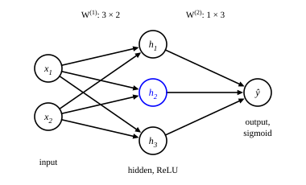

::: card
One neuron is a linear function followed by a squash, so it can only draw one boundary. To
represent more complex functions, you place many neurons side by side in a **layer**, and you
stack the layers.

The result is a **feedforward network**, also called a multilayer perceptron or MLP. It has an
input layer, the raw input $\mathbf{x} \in \mathbb{R}^{n_0}$; one or more **hidden layers**,
which hold intermediate representations; and an output layer, the prediction
$\mathbf{y} \in \mathbb{R}^{n_L}$.
:::

::: card
Set $\mathbf{h}^{(0)} = \mathbf{x}$. Each layer $\ell = 1, \ldots, L$ applies its weights and
bias, then the activation, element by element:[The layer](reference:mlp-layer)

$$ \mathbf{z}^{(\ell)} = \mathbf{W}^{(\ell)} \mathbf{h}^{(\ell-1)} + \mathbf{b}^{(\ell)} \qquad \mathbf{h}^{(\ell)} = \sigma\left(\mathbf{z}^{(\ell)}\right) $$

The weight matrix is $\mathbf{W}^{(\ell)} \in \mathbb{R}^{n_\ell \times n_{\ell-1}}$ and the bias
is $\mathbf{b}^{(\ell)} \in \mathbb{R}^{n_\ell}$. The output is $\mathbf{y} = \mathbf{h}^{(L)}$.
:::

::: card
Here is a small network to run by hand ([Figure](figure:mlp-2-3-1)). It has $n_0 = 2$ inputs,
a hidden layer of $n_1 = 3$ ReLU neurons, and $n_2 = 1$ sigmoid output. So
$\mathbf{W}^{(1)} \in \mathbb{R}^{3 \times 2}$ and $\mathbf{W}^{(2)} \in \mathbb{R}^{1 \times 3}$.
:::

::: figure mlp-2-3-1


Every input feeds every hidden neuron, and every hidden neuron feeds the output. The neuron
$h_2$ is the one that the example silences.
:::

::: card
The parameters are:

$$ \mathbf{W}^{(1)} = \begin{bmatrix} 0.2 & 0.4 \\ -0.5 & 0.3 \\ 0.1 & -0.2 \end{bmatrix} \quad \mathbf{b}^{(1)} = \begin{bmatrix} 0.1 \\ -0.1 \\ 0.2 \end{bmatrix} \quad \mathbf{W}^{(2)} = \begin{bmatrix} 0.6 & -0.4 & 0.5 \end{bmatrix} \quad b^{(2)} = -0.2 $$

The input is $\mathbf{x} = [1.0, 0.5]^T$.
:::

::: card
The hidden layer first forms its weighted sums:

$$ \mathbf{z}^{(1)} = \begin{bmatrix} 0.2 \cdot 1.0 + 0.4 \cdot 0.5 \\ -0.5 \cdot 1.0 + 0.3 \cdot 0.5 \\ 0.1 \cdot 1.0 - 0.2 \cdot 0.5 \end{bmatrix} + \begin{bmatrix} 0.1 \\ -0.1 \\ 0.2 \end{bmatrix} = \begin{bmatrix} 0.4 \\ -0.35 \\ 0 \end{bmatrix} + \begin{bmatrix} 0.1 \\ -0.1 \\ 0.2 \end{bmatrix} = \begin{bmatrix} 0.5 \\ -0.45 \\ 0.2 \end{bmatrix} $$
:::

::: card
Then the ReLU clips each entry at zero:

$$ \mathbf{h}^{(1)} = \begin{bmatrix} \max(0, 0.5) \\ \max(0, -0.45) \\ \max(0, 0.2) \end{bmatrix} = \begin{bmatrix} 0.5 \\ 0 \\ 0.2 \end{bmatrix} $$

The second neuron outputs 0, because its sum was negative. For this input, the ReLU silences
that neuron.
:::

::: card
The output neuron takes the hidden values:

$$ z^{(2)} = 0.6 \cdot 0.5 + (-0.4) \cdot 0 + 0.5 \cdot 0.2 - 0.2 = 0.3 + 0 + 0.1 - 0.2 = 0.2 $$

$$ y = \sigma(0.2) = \frac{1}{1 + e^{-0.2}} \approx 0.55 $$

The network maps the input $[1.0, 0.5]^T$ to about 0.55.
:::

::: card
A hidden layer of ReLU neurons builds a bent line. With one input, each neuron
$a_j \max(0, x - c_j)$ adds one kink at $c_j$, and the output weight $a_j$ sets how much the
slope changes there. Three neurons, kinks at $-1$, $0$ and $1$:

```plot
x: { var: x, label: "$x$", from: -3, to: 3, ticks: 1, grid: true }
y: { label: "$y$", from: -3, to: 3 }

inputs:
  - { name: a1, min: -2, max: 2, default: 1, step: 0.25, label: "weight of the kink at -1" }
  - { name: a2, min: -2, max: 2, default: -2, step: 0.25, label: "weight of the kink at 0" }
  - { name: a3, min: -2, max: 2, default: 1.5, step: 0.25, label: "weight of the kink at 1" }

draw:
  - vline: { at: -1, dash: true }
  - vline: { at: 0, dash: true }
  - vline: { at: 1, dash: true }
  - curve: { is: "a1 * max(0, x + 1) + a2 * max(0, x) + a3 * max(0, x - 1) - 1", accent: true }
```

More neurons give more kinks, and a line with enough kinks can follow any continuous curve.
:::

::: exercise mlp-shapes
A network maps $\mathbb{R}^{4}$ to $\mathbb{R}^{2}$ through one hidden layer of 5 neurons. What
are the shapes of $\mathbf{W}^{(1)}$ and $\mathbf{W}^{(2)}$, and how many parameters does it have
in total, biases included?

::: answer
$\mathbf{W}^{(1)}$ is $5 \times 4$, $\mathbf{W}^{(2)}$ is $2 \times 5$, and the total is 37.
A weight matrix has shape (outputs) $\times$ (inputs).
:::

::: solution
Layer 1: $5 \times 4 = 20$ weights and 5 biases.

Layer 2: $2 \times 5 = 10$ weights and 2 biases.

Total: $20 + 5 + 10 + 2 = 37$. ∎
:::
:::

::: exercise mlp-forward
A network has one input, two ReLU hidden neurons with $\mathbf{W}^{(1)} = [1, -1]^T$ and
$\mathbf{b}^{(1)} = [0, 1]^T$, and a linear output with $\mathbf{W}^{(2)} = [2, 3]$ and
$b^{(2)} = 0$. What does it output for $x = 2$?

::: answer
4. The second hidden neuron is silenced.
:::

::: solution
$$ \mathbf{z}^{(1)} = \begin{bmatrix} 1 \cdot 2 + 0 \\ -1 \cdot 2 + 1 \end{bmatrix} = \begin{bmatrix} 2 \\ -1 \end{bmatrix} \qquad \mathbf{h}^{(1)} = \begin{bmatrix} 2 \\ 0 \end{bmatrix} $$

$$ y = 2 \cdot 2 + 3 \cdot 0 + 0 = 4 $$

∎
:::
:::

::: exercise mlp-silenced-neuron
In the worked example, which input change brings the second hidden neuron back to life: an
input $\mathbf{x} = [0, 1]^T$ or $\mathbf{x} = [1, 0]^T$?

::: answer
$\mathbf{x} = [0, 1]^T$, where $z^{(1)}_2 = 0.2 > 0$.
:::

::: solution
The second row is $z^{(1)}_2 = -0.5\,x_1 + 0.3\,x_2 - 0.1$.

For $[0, 1]^T$: $z^{(1)}_2 = 0 + 0.3 - 0.1 = 0.2 > 0$, so the neuron is active.

For $[1, 0]^T$: $z^{(1)}_2 = -0.5 + 0 - 0.1 = -0.6 < 0$, so it stays silenced. ∎
:::
:::

::: reference mlp-layer
# A layer of a feedforward network

A layer multiplies the output of the layer before it by a weight matrix, adds a bias, and applies
the activation to each entry.

::: equation
\mathbf{z}^{(\ell)} = \mathbf{W}^{(\ell)} \mathbf{h}^{(\ell-1)} + \mathbf{b}^{(\ell)} \qquad \mathbf{h}^{(\ell)} = \sigma\left(\mathbf{z}^{(\ell)}\right) \qquad \mathbf{h}^{(0)} = \mathbf{x}
:::

::: legend
$\mathbf{h}^{(\ell)}$: the output of layer $\ell$, a vector in $\mathbb{R}^{n_\ell}$
$\mathbf{z}^{(\ell)}$: the pre-activation of layer $\ell$, a vector in $\mathbb{R}^{n_\ell}$
$\mathbf{W}^{(\ell)}$: the weights of layer $\ell$, a matrix in $\mathbb{R}^{n_\ell \times n_{\ell-1}}$
$\mathbf{b}^{(\ell)}$: the bias of layer $\ell$, a vector in $\mathbb{R}^{n_\ell}$
$\sigma$: the activation, applied to each entry
:::

::: derivation
Row $j$ of $\mathbf{W}^{(\ell)}$ holds the weights of neuron $j$, so entry $j$ of the matrix-vector product is that neuron's weighted sum.[Matrix-vector product](reference:matrix-vector-product)
Adding $b^{(\ell)}_j$ and applying $\sigma$ gives the output of neuron $j$.[Neuron](reference:neuron)
All $n_\ell$ neurons at once give the two vector equations. ∎
:::
:::
