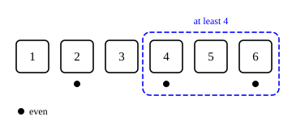

::: card
You roll a die behind a screen. What is the probability that it shows an even number? Three of the
six faces are even, 2, 4 and 6, so the answer is $\frac{3}{6} = 50\%$.
:::

::: card
A friend peeks and says: "It is at least 4." Only 4, 5 and 6 remain possible. Of those three, two
are even, 4 and 6. Your belief moves from $\frac{3}{6}$ to $\frac{2}{3} \approx 67\%$
([Figure](figure:die-condition)).
:::

::: figure die-condition


The hint "at least 4" keeps three faces and drops the rest. Two of the three faces kept are even,
so the probability of even becomes $\frac{2}{3}$.
:::

::: card
$P(A \mid B)$ is the probability of $A$ **given** that $B$ is true. Read the bar as "given that".

$$ P(\text{even}) = \frac{1}{2} \qquad P(\text{even} \mid \text{at least 4}) = \frac{2}{3} $$

The first has no extra information. The second uses the hint.
:::

::: card
The hint shrinks the world to $B$, and you ask how much of that smaller world also lies in $A$:[Conditional probability](reference:conditional-probability)

$$ P(A \mid B) = \frac{P(A \text{ and } B)}{P(B)} $$

For the die: $P(\text{even and at least 4}) = P(\{4, 6\}) = \frac{2}{6}$ and
$P(\text{at least 4}) = \frac{3}{6}$, so $P(\text{even} \mid \text{at least 4}) = \frac{2/6}{3/6} = \frac{2}{3}$.
:::

::: card
A language model is built from conditional probability. Given the words so far, it gives a
probability to each next word. After "The cat sat on the":

$$ P(\text{mat} \mid \text{The cat sat on the}) = 0.35 \qquad P(\text{floor} \mid \ldots) = 0.20 $$

and so on, down to $P(\text{elephant} \mid \ldots) = 0.0001$.
:::

::: card
The probability of a whole sentence is a product of conditionals, one per word. This is the
**chain rule of probability**:[The chain rule of probability](reference:probability-chain-rule)

$$ P(\text{The cat sat}) = P(\text{The}) \cdot P(\text{cat} \mid \text{The}) \cdot P(\text{sat} \mid \text{The cat}) $$

$$ = 0.05 \times 0.02 \times 0.15 = 0.00015 $$

A transformer generates text the same way: predict one token, append it, predict the next.
:::

::: card
A product of many factors below 1 shrinks fast. If every word gets probability $p$, a sentence of
$n$ words gets $p^n$. At $p = 0.5$, ten words already give less than 0.001. This is why models add
log probabilities instead of multiplying probabilities: $\log P = \sum \log P(\text{word} \mid \text{context})$.

```plot
x: { var: n, label: "number of words $n$", from: 1, to: 20, ticks: 1, grid: true }
y: { label: "$pⁿ$", from: 0, to: 1, ticks: 0.25 }

inputs:
  - { name: p, min: 0.1, max: 0.99, default: 0.5, step: 0.01, label: "probability per word p" }

draw:
  - curve: { is: p^n, accent: true }
```
:::

::: exercise q1
$X$ is the roll of a fair die. What is $P(X = 6 \mid X \text{ is even})$?

::: answer
$\frac{1}{3}$. Given even, three faces remain, and one of them is 6.
:::

::: solution
$$ P(X = 6 \text{ and even}) = \frac{1}{6}, \qquad P(\text{even}) = \frac{3}{6} $$

$$ P(X = 6 \mid \text{even}) = \frac{1/6}{3/6} = \frac{1}{3} $$

∎
:::
:::

::: exercise q2
$P(A \text{ and } B) = 0.12$ and $P(B) = 0.4$. What is $P(A \mid B)$?

::: answer
$0.3$. Divide the joint probability by $P(B)$.
:::
:::

::: exercise q3
A model gives $P(w_1) = 0.1$, $P(w_2 \mid w_1) = 0.5$ and $P(w_3 \mid w_1 w_2) = 0.4$. What
probability does it give the three-word sequence $w_1 w_2 w_3$?

::: answer
$0.02$. Multiply the conditionals in order.
:::

::: solution
$$ P(w_1 w_2 w_3) = 0.1 \times 0.5 \times 0.4 = 0.02 $$

∎
:::
:::

::: reference conditional-probability
# Conditional probability

The probability of $A$ given $B$ is the share of the probability of $B$ that also lies in $A$. It is
defined when $P(B) > 0$.

::: equation
P(A \mid B) = \frac{P(A \cap B)}{P(B)}
:::

::: legend
$P(A \mid B)$: the probability of $A$ given that $B$ is true
$P(A \cap B)$: the probability that $A$ and $B$ are both true
$P(B)$: the probability of $B$, above zero
:::
:::

::: reference probability-chain-rule
# The chain rule of probability

The joint probability of a sequence is the product of the probability of each item given all the
items before it.

::: equation
P(x_1, x_2, \ldots, x_n) = \prod_{t=1}^{n} P(x_t \mid x_1, \ldots, x_{t-1})
:::

::: legend
$x_t$: the item at position $t$ of the sequence
$P(x_t \mid x_1, \ldots, x_{t-1})$: its probability given every earlier item; for $t = 1$ it is $P(x_1)$
:::

::: derivation
Multiply the definition of $P(B \mid A)$ by $P(A)$: $P(A \cap B) = P(A)\, P(B \mid A)$.[Conditional probability](reference:conditional-probability)
Take $A = (x_1, \ldots, x_{n-1})$ and $B = x_n$: $P(x_1, \ldots, x_n) = P(x_1, \ldots, x_{n-1})\, P(x_n \mid x_1, \ldots, x_{n-1})$.
Apply the same step to $P(x_1, \ldots, x_{n-1})$, and again, down to $P(x_1)$.
The factors that remain are the product over $t = 1, \ldots, n$. ∎
:::
:::
