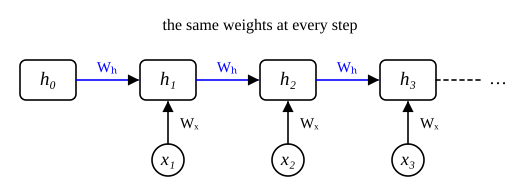

::: card
A **recurrent neural network**, or RNN, reads a sequence one element at a time and keeps a
**hidden state** $\mathbf{h}_t$, a summary of everything it has read so far. At step $t$ it takes
the input $\mathbf{x}_t$ and the previous state $\mathbf{h}_{t-1}$, and makes a new state
([RNN update](reference:rnn-update)):

$$ \mathbf{h}_t = \tanh\left(\mathbf{W}_h \mathbf{h}_{t-1} + \mathbf{W}_x \mathbf{x}_t + \mathbf{b}\right) $$
:::

::: card
The shapes: $\mathbf{W}_h \in \mathbb{R}^{d \times d}$ maps the old state to the new,
$\mathbf{W}_x \in \mathbb{R}^{d \times n}$ maps the input, and $\mathbf{b} \in \mathbb{R}^d$. The
state size $d$ is a choice of the designer. The key point: **the same weights work at every
step**. The network learns one update and applies it again and again, so a word teaches the same
weights wherever it appears.
:::

::: card
Unroll the loop and the RNN becomes a chain, one box per step, all sharing $\mathbf{W}_h$ and
$\mathbf{W}_x$ ([Figure](figure:unrolled-rnn)). It looks like a very deep feedforward network
whose layers all hold the same weights.
:::

::: figure unrolled-rnn

Each step takes the previous state and the next input. Every step uses the same $\mathbf{W}_h$
and $\mathbf{W}_x$.
:::

::: card
Trace a tiny RNN with $d = 2$ over the inputs $x_1 = 1$, $x_2 = -1$, $x_3 = 2$, starting from
$\mathbf{h}_0 = \mathbf{0}$:

$$ \mathbf{W}_h = \begin{bmatrix} 0.5 & 0.1 \\ 0.2 & 0.6 \end{bmatrix}, \quad \mathbf{W}_x = \begin{bmatrix} 0.3 \\ 0.4 \end{bmatrix}, \quad \mathbf{b} = \mathbf{0} $$

Step 1: $\mathbf{h}_1 = \tanh([0.3, 0.4]^T) = [0.291, 0.380]^T$.
:::

::: card
Step 2 adds the memory of step 1 to the new input:

$$ \mathbf{h}_2 = \tanh\left(\begin{bmatrix} 0.146 + 0.038 \\ 0.058 + 0.228 \end{bmatrix} - \begin{bmatrix} 0.3 \\ 0.4 \end{bmatrix}\right) = \tanh\begin{bmatrix} -0.116 \\ -0.114 \end{bmatrix} = \begin{bmatrix} -0.116 \\ -0.113 \end{bmatrix} $$
:::

::: card
Step 3:

$$ \mathbf{h}_3 = \tanh\left(\begin{bmatrix} -0.058 - 0.011 \\ -0.023 - 0.068 \end{bmatrix} + \begin{bmatrix} 0.6 \\ 0.8 \end{bmatrix}\right) = \tanh\begin{bmatrix} 0.531 \\ 0.709 \end{bmatrix} = \begin{bmatrix} 0.486 \\ 0.610 \end{bmatrix} $$

The final state depends on all three inputs, through the chain of steps.
:::

::: exercise q1
An RNN has $d = 128$ and inputs of size $n = 300$. How many parameters do $\mathbf{W}_h$,
$\mathbf{W}_x$ and $\mathbf{b}$ hold together? Does the count depend on the sequence length?

::: answer
54,912, and no. $128^2 + 128 \cdot 300 + 128$; the same weights serve every step.
:::

::: solution
$\mathbf{W}_h$: $128 \times 128 = 16{,}384$.

$\mathbf{W}_x$: $128 \times 300 = 38{,}400$.

$\mathbf{b}$: 128.

Total: $16{,}384 + 38{,}400 + 128 = 54{,}912$. ∎
:::
:::

::: exercise q2
A scalar RNN has $h_t = \tanh(0.5\,h_{t-1} + x_t)$ and $h_0 = 0$. What is $h_2$ for $x_1 = 1$,
$x_2 = 0$?

::: answer
About $0.363$. $h_1 = \tanh 1 \approx 0.762$, then $h_2 = \tanh(0.381)$.
:::
:::

::: reference rnn-update
# RNN update

A recurrent network makes its new hidden state from the previous state and the current input,
with the same weights at every step.

::: equation
\mathbf{h}_t = \tanh\left(\mathbf{W}_h \mathbf{h}_{t-1} + \mathbf{W}_x \mathbf{x}_t + \mathbf{b}\right)
:::

::: legend
$\mathbf{h}_t$: the hidden state after step $t$, in $\mathbb{R}^d$; $\mathbf{h}_0$ is usually zero
$\mathbf{x}_t$: the input at step $t$, in $\mathbb{R}^n$
$\mathbf{W}_h$: the state weights, $d \times d$
$\mathbf{W}_x$: the input weights, $d \times n$
$\mathbf{b}$: the bias, in $\mathbb{R}^d$
:::
:::
